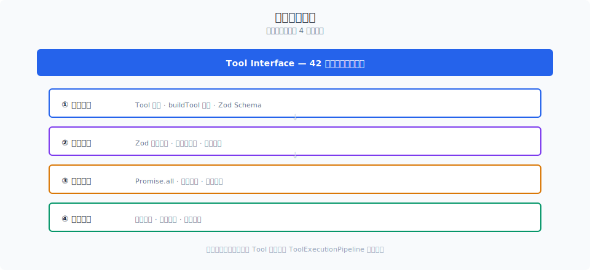
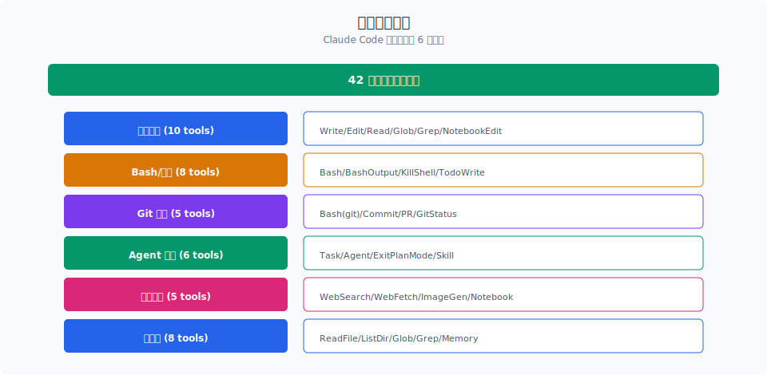

# 工具接口与注册

> Claude Code 内置 42 个工具，通过 `Tool.ts` 定义的统一接口接入 Agent 循环。`buildTool` 工厂函数用默认值补齐每个工具的通用行为，让工具作者只写差异部分。

你好，我是江小湖。

上一篇 [StreamingToolExecutor](../03-agent-loop/03-streaming-executor.md) 讲到，Agent 循环通过边收边执行的方式调度工具。这一篇深入工具的"设计层"：Claude Code 如何用一种接口管住 42 个形态各异的工具。

## 目录

- [Tool 接口：21 个方法搞定的统一抽象](#tool-接口21-个方法搞定的统一抽象)
- [buildTool 工厂：用默认值说清意图](#buildtool-工厂用默认值说清意图)
- [42 个工具的五种分类](#42-个工具的五种分类)
- [工具注册：三种注册入口](#工具注册三种注册入口)
- [ToolUseContext：工具能看到的上下文](#toolusecontext工具能看到的上下文)
- [总结](#总结)
- [参考链接](#参考链接)

<p align="center">
  
  <br/>
  <em>4 层流水线：发现 → 校验 → 调度 → 收集</em>
</p>

<p align="center">
  
  <br/>
  <em>42 个内置工具的 6 大分类</em>
</p>


## Tool 接口：21 个方法搞定的统一抽象

`Tool.ts`（793 行）定义了所有工具的通用接口。这个接口有 21 个方法，但每个工具不需要全部实现——`buildTool` 工厂函数会给缺省的方法填充安全默认值。

核心方法按职责可以分成五组：

### 行为声明组

这三个方法让工具"自报家门"，告诉 Agent 循环和权限系统自己是什么：

```typescript
interface Tool {
  isEnabled(): boolean               // 是否启用
  isReadOnly(input): boolean         // 是否只读
  isConcurrencySafe(input): boolean  // 是否可并发
  isDestructive?(input): boolean     // 是否有破坏性（默认 false）
}
```

| 方法 | 作用 | 默认值 | 影响什么 |
|------|------|--------|---------|
| `isEnabled()` | 工具是否可用 | `true` | 从模型视野中移除 |
| `isReadOnly(input)` | 是否只读 | `false` | 权限模式（Plan 模式只允许只读） |
| `isConcurrencySafe(input)` | 能否并行调用 | `false` | 并发调度策略 |
| `isDestructive(input)` | 是否有破坏性 | `false` | 权限提示、auto 模式判断 |

这四个布尔值不是"描述"，而是**运行时的控制信号**。`Plan` 模式下，所有返回 `isReadOnly: false` 的工具调用都会被拦截。

一个值得注意的设计是：`isReadOnly` 和 `isConcurrencySafe` 都接受 `input` 参数。同一个工具，不同输入可能有不同的安全属性。比如 `BashTool` 执行 `ls` 是只读且可并发的，但执行 `rm -rf` 就不是。

### 核心调用组

这是工具真正干活的部分：

```typescript
interface Tool {
  call(input, context, canUseTool, parentMessage, onProgress?)
    : Promise<ToolResult>

  description(input, options): Promise<string>

  validateInput?(input, context): Promise<ValidationResult>
}
```

- **`call()`** — 执行工具。接收 Zod 校验后的输入、工具上下文、权限检查函数、原始消息、进度回调。
- **`description()`** — 向模型描述自己。不是静态字符串，可以根据输入和上下文动态生成。
- **`validateInput()`** — 在权限检查之前对输入做业务校验。比如 `BashTool` 可以在这里判断命令是否需要取消。

### 权限检查组

工具级的权限逻辑独立于通用权限系统：

```typescript
interface Tool {
  checkPermissions(input, context): Promise<PermissionResult>
  preparePermissionMatcher?(input)
    : Promise<(pattern: string) => boolean>
}
```

`checkPermissions` 在 `validateInput` 通过之后、`call` 之前执行，负责工具特定的权限判断。

`preparePermissionMatcher` 为权限 Hook 提供模式匹配能力。它把昂贵的解析缓存起来，供 Hook 的 `"Bash(git *)"` 这类模式反复匹配。

### UI 渲染组

Claude Code 的终端 UI 需要每个工具提供自己的渲染逻辑：

```typescript
interface Tool {
  renderToolUseMessage(input, options): React.ReactNode    // 工具调用时显示
  renderToolResultMessage?(content, progress, options)     // 工具结果展示
  renderToolUseRejectedMessage?(input, options)            // 被拒绝时的 UI
  renderToolUseErrorMessage?(result, options)              // 出错时的 UI
  getToolUseSummary?(input): string | null                 // 紧凑视图摘要
  getActivityDescription?(input): string | null            // Spinner 描述
  renderGroupedToolUse?(uses, options): React.ReactNode    // 批量渲染
  userFacingName(input): string                            // 面向用户的名称
}
```

每个工具在终端里如何展示、被拒绝时怎么提示、结果怎么折叠——都由这一组方法决定。这不是纯"美化"，而是**可观测性**：用户透过 UI 看到 Agent 在做什么。

### 高级控制组

这组方法处理延迟加载、搜索匹配、进度和搜索辅助等边缘需求：

```typescript
interface Tool {
  shouldDefer?: boolean           // 是否延迟加载
  alwaysLoad?: boolean            // 是否总是加载
  searchHint?: string             // 搜索提示词
  maxResultSizeChars: number      // 结果大小上限
  backfillObservableInput?(input) // 补全观察者字段
  isSearchOrReadCommand?(input)   // 搜索/读取操作标记
  isOpenWorld?(input): boolean    // 是否开放世界操作
  toAutoClassifierInput(input)    // auto 模式分类器输入
  mapToolResultToToolResultBlockParam(content, id)  // 结果序列化
}
```

其中 `shouldDefer` 和 `alwaysLoad` 配合 `ToolSearchTool` 工作：工具太多时，不常用的工具延迟加载，模型需要先调 `ToolSearch` 搜索才能使用。

## buildTool 工厂：用默认值说清意图

`Tool.ts` 最后 70 行是 `buildTool` 工厂函数。它接受一个 `ToolDef`（可省略部分方法），返回完整的 `Tool`。

```typescript
const TOOL_DEFAULTS = {
  isEnabled: () => true,
  isConcurrencySafe: (_input?) => false,   // 默认不安全
  isReadOnly: (_input?) => false,           // 默认不是只读
  isDestructive: (_input?) => false,        // 默认无破坏性
  checkPermissions: (input) =>
    Promise.resolve({ behavior: 'allow', updatedInput: input }),
  toAutoClassifierInput: (_input?) => '',   // 默认跳过分类器
  userFacingName: (_input?) => '',
}

export function buildTool<D extends AnyToolDef>(def: D): BuiltTool<D> {
  return {
    ...TOOL_DEFAULTS,
    userFacingName: () => def.name,
    ...def,
  } as BuiltTool<D>
}
```

默认值的哲学是"fail-closed"：如果工具作者没明确说安全，那就假定不安全。`isConcurrencySafe` 默认 `false`，意味着默认串行执行——宁可慢，不乱。

`buildTool` 的返回类型 `BuiltTool<D>` 在类型层面精确反映了这个"默认值 + 覆盖"的语义。60 多个工具文件全部通过类型检查，不需要任何 `as any` 绕过。

## 42 个工具的五种分类

按用途，Claude Code 的 42 个工具可以分成五类：

| 分类 | 工具 | 数量 | 说明 |
|------|------|------|------|
| **文件操作** | FileReadTool、FileEditTool、FileWriteTool、GlobTool、GrepTool、LSPTool、NotebookEditTool | 7 | 代码读写、搜索、补全 |
| **命令执行** | BashTool、PowerShellTool | 2 | Shell 命令、跨平台脚本 |
| **子 Agent** | AgentTool、TaskCreateTool、TaskGetTool、TaskListTool、TaskStopTool、TaskUpdateTool、TaskOutputTool、TeamCreateTool、TeamDeleteTool、SendMessageTool | 10 | 任务拆分、编队、通信 |
| **工作流** | EnterPlanModeTool、ExitPlanModeTool、EnterWorktreeTool、ExitWorktreeTool、TodoWriteTool、ToolSearchTool、SkillTool | 7 | 计划模式、分支隔离、清单跟踪 |
| **扩展与设置** | MCPTool、McpAuthTool、ListMcpResourcesTool、ReadMcpResourceTool、WebSearchTool、WebFetchTool、ConfigTool、SleepTool、CronCreateTool、CronDeleteTool、CronListTool、BriefTool、SyntheticOutputTool、RemoteTriggerTool、AskUserQuestionTool、REPLTool | 16 | 外部协议、配置、定时、交互 |

从数量分布能看出 Claude Code 的设计重心：子 Agent 和扩展协议占了超过一半的工具数量。这说明 Claude Code 不只是"让 LLM 读写文件"，而是在构建一套完整的 Agent 操作系统——工具编排、任务拆分、外部协议接入、安全控制都在工具层有体现。

## 工具注册：三种注册入口

工具不是一次性全部注册的。Claude Code 有三种注册入口：

### 1. 内置工具注册（启动时）

`tools/toolCollections.ts` 在启动时注册所有内置工具。60 多个工具文件通过 `buildTool` 创建后，汇入一个 `Tools` 数组。这个数组是 `readonly` 的——工具集合一旦建立，就不会被运行时修改。

### 2. MCP 工具注册（运行时）

MCP 服务器启动后，通过 `MCPTool` 协议注入外部工具。这些工具在 Claude Code 看来和内置工具没有区别——它们实现了相同的 `Tool` 接口，在 `ToolUseContext.mcpClients` 里有对应的连接对象。每次 MCP 服务器连接成功，都会触发工具列表的增量更新。

### 3. Agent 定义注入（配置驱动）

`AgentTool` 读取 `CLAUDE.md` 或 `.claude/agents/` 目录中的 Agent 定义文件，把每个 Agent 暴露为一个可调用的"工具"。从 Agent 循环的视角看，调用一个子 Agent 和调用 `BashTool` 没有本质区别。

## ToolUseContext：工具能看到的上下文

工具不是孤立的。每个工具的 `call()` 方法接收一个 `ToolUseContext` 对象，包含了当前 Agent 会话的全部上下文：

```typescript
type ToolUseContext = {
  options: {
    commands: Command[]           // 用户定义的快捷命令
    mainLoopModel: string         // 当前模型名
    tools: Tools                  // 全部工具列表
    mcpClients: MCPServerConnection[]  // MCP 连接
    agentDefinitions: AgentDefinitionsResult  // Agent 定义
    maxBudgetUsd?: number         // 成本上限
  }
  abortController: AbortController  // 取消信号
  readFileState: FileStateCache     // 文件读取缓存
  getAppState(): AppState           // 全局应用状态
  messages: Message[]               // 当前消息历史
}
```

`ToolUseContext` 的设计遵循了"最少特权"原则：工具只能通过这个对象访问外部世界，不能直接 import 全局模块或随意访问文件系统。

## 总结

- Claude Code 通过 `Tool.ts` 的 21 个方法定义了统一的工具接口，涵盖行为声明、核心调用、权限检查、UI 渲染、高级控制五大组。
- `buildTool` 工厂函数采用 fail-closed 默认值哲学：工具作者只写差异，不写的东西一律假定不安全。
- 42 个工具分为五类：文件操作（7）、命令执行（2）、子 Agent（10）、工作流（7）、扩展与设置（16）。
- 工具有三种注册入口：启动时注册内置工具、运行时注册 MCP 工具、配置驱动的 Agent 定义注入。
- `ToolUseContext` 封装了工具能访问的全部上下文，遵循最少特权原则。

> 下一篇：[工具执行 Pipeline](./02-execution-pipeline.md)，看工具从模型输出到结果返回之间的 8 步流水线。

## 参考链接

- [Claude Code Tool.ts 源码](file:///E:/Projects/claude-code/src/Tool.ts)
- [Claude Code tools/ 目录](file:///E:/Projects/claude-code/src/tools/)
- [Claude Code 工具搜索与延迟加载](file:///E:/Projects/claude-code/src/tools/ToolSearchTool/)
- [Anthropic Claude Code 官方文档](https://docs.anthropic.com/en/docs/claude-code/overview)
