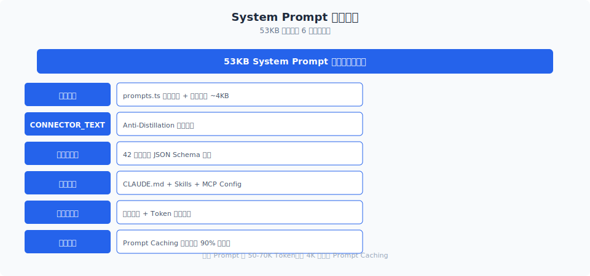

# 缓存冻结

> Claude Code 的系统提示词有一半是静态的——和你是谁、你装了什么工具、你在做什么项目完全无关。`DYNAMIC_BOUNDARY` 把这部分冻结起来，让全球用户共享同一份 Prompt Cache。这一设计每天为 Anthropic 节省数百万 token 的写入成本。

你好，我是江小湖。

上一篇 [动态拼装](./01-dynamic-assembly.md) 讲到系统提示词由 40+ 个碎片组成。这一篇聚焦缓存策略：Claude Code 如何把"能共享的"和"不能共享的"精确分开，最大化跨组织缓存命中率。

## 目录

- [两层缓存架构](#两层缓存架构)
- [DYNAMIC_BOUNDARY 的分界线](#dynamic_boundary-的分界线)
- [splitSysPromptPrefix：切割与重组](#splitsyspromptprefix切割与重组)
- [缓存命中率的工程权衡](#缓存命中率的工程权衡)
- [与第 05 章 Latch 的协同](#与第-05-章-latch-的协同)
- [总结](#总结)
- [参考链接](#参考链接)

<p align="center">
  
  <br/>
  <em>三级缓存策略降低 API 调用成本</em>
</p>

<p align="center">
  
  <br/>
  <em>53KB 提示词的 6 层组装过程</em>
</p>


## 两层缓存架构

Anthropic 的 Prompt Caching 支持两种 scope：

| Scope | 共享范围 | 成本 | 适用场景 |
|-------|---------|------|---------|
| `global` | 跨所有组织 | 写入 1.25× base，读取 0.1× base | 完全通用的内容 |
| `organization` | 同一组织内 | 写入 1.25× base，读取 0.1× base | 组织专属内容 |

Claude Code 利用这两种 scope，把系统提示词拆成两层：

```
┌─────────────────────────────────┐
│  Static (global cache scope)    │  ← 全球共享，一次性写入
│  - 身份与基础指令                │
│  - 系统环境描述                  │
│  - 任务执行指南（60+ 条规则）     │
│  - 代码风格与输出格式            │
│  - 工具使用通用说明              │
├─────────────────────────────────┤
│  DYNAMIC_BOUNDARY               │  ← 分割线
├─────────────────────────────────┤
│  Dynamic (org cache scope)      │  ← 组织内共享
│  - CLAUDE.md 内容               │
│  - MCP 服务器指令                │
│  - Memory 模块输出               │
│  - 语言/输出风格偏好             │
│  - Session-specific 指南         │
└─────────────────────────────────┘
```

静态区占总提示词的 70% 以上。这意味着全球所有 Claude Code 用户共享同一份 35-50K token 的缓存——每毫秒都有新用户命中这份缓存，而 Anthropic 只为它支付了一次写入成本。

## DYNAMIC_BOUNDARY 的分界线

边界标记的定义很简单：

```typescript
export const SYSTEM_PROMPT_DYNAMIC_BOUNDARY =
  '__SYSTEM_PROMPT_DYNAMIC_BOUNDARY__'
```

但它的作用很重要——`buildSystemPromptBlocks` 根据这个标记决定哪些 block 用 global scope：

```typescript
// claude.ts — buildSystemPromptBlocks 概念逻辑
function buildSystemPromptBlocks(
  systemPrompt: string[],
  enablePromptCaching: boolean,
): TextBlockParam[] {
  const blocks: TextBlockParam[] = []
  let foundBoundary = false

  for (const section of systemPrompt) {
    if (section === SYSTEM_PROMPT_DYNAMIC_BOUNDARY) {
      foundBoundary = true
      continue  // 边界标记本身不产生内容
    }

    const block: TextBlockParam = {
      type: 'text',
      text: section,
    }

    if (enablePromptCaching) {
      block.cache_control = foundBoundary
        ? { type: 'ephemeral' }       // 动态区：org scope
        : { type: 'ephemeral', scope: 'global' }  // 静态区：global scope
    }

    blocks.push(block)
  }

  return blocks
}
```

关键逻辑在 `cache_control.scope` 字段：边界之前的 block 设置 `scope: 'global'`，边界之后的 block 设置 `scope: 'ephemeral'`（即 org scope）。

如果 `shouldUseGlobalCacheScope()` 返回 false（第三方 API 或旧模型），整个系统提示词不插入边界标记，所有 block 统一使用 org scope。这是降级策略——global scope 不可用时不强求。

## splitSysPromptPrefix：切割与重组

`splitSysPromptPrefix` 是 `utils/api.ts` 中的一个工具函数，它负责把系统提示词数组按边界切割：

```typescript
// utils/api.ts — 概念逻辑
export function splitSysPromptPrefix(
  systemBlocks: TextBlockParam[],
): {
  prefix: TextBlockParam[]
  suffix: TextBlockParam[]
} {
  const boundaryIndex = systemBlocks.findIndex(
    b => 'text' in b && b.text === SYSTEM_PROMPT_DYNAMIC_BOUNDARY
  )

  if (boundaryIndex === -1) {
    return { prefix: systemBlocks, suffix: [] }
  }

  return {
    prefix: systemBlocks.slice(0, boundaryIndex),
    suffix: systemBlocks.slice(boundaryIndex + 1),
  }
}
```

切割后的 prefix 和 suffix 分别用于不同的缓存策略。这个切割操作在每次 API 调用时都会执行，但因为只是数组切片，性能开销几乎为零。

## 缓存命中率的工程权衡

global scope 缓存有一个权衡：**任何变更都会导致全球缓存失效**。

如果 Claude Code 在静态区加了一个空格，全球的缓存全部失效，所有用户的下一次请求都需要重新写入缓存。Anthropic 这边会短暂地看到一个巨大的 cache_creation token 高峰。

因此，静态区的修改是高度受控的：

- **Safeguards 团队审核**：安全相关的修改需要专门团队审批
- **模型发布对齐**：静态区更新通常和新模型发布同步，避免频繁变动
- **@[MODEL LAUNCH] 标记**：源码中用注释标记了需要在模型发布时更新的地方

```typescript
// @[MODEL LAUNCH]: Update the latest frontier model.
const FRONTIER_MODEL_NAME = 'Claude Opus 4.6'
```

## 与第 05 章 Latch 的协同

缓存冻结和 Sticky-on Latch 是同一枚硬币的两面：

- **缓存冻结**解决的是"提示词内容变化导致缓存失效"
- **Sticky-on Latch** 解决的是"beta header 变化导致缓存失效"

两者配合，从内容和元数据两个维度锁定缓存。任何一方失效，另一方仍然能保护大部分缓存。这种"纵深防御"思路贯穿了 Claude Code 的整个缓存策略设计。

## 总结

- 系统提示词使用两层缓存架构：静态区 global scope（全球共享），动态区 org scope（组织内共享）。
- `DYNAMIC_BOUNDARY` 标记精确分割静态和动态内容，静态区占 70% 以上。
- `splitSysPromptPrefix` 在每次 API 调用时执行切割，零性能开销。
- 静态区修改高度受控，通常和新模型发布同步，避免频繁变动。
- 缓存冻结和 Sticky-on Latch 形成纵深防御，从内容和元数据两个维度保护缓存。

> 下一篇：[CLAUDE.md 与安全守则](./03-claude-md.md)，看项目上下文如何注入系统提示词，以及 1549 字节的安全守则为何有"永不修改"的注释。

## 参考链接

- [Claude Code prompts.ts — DYNAMIC_BOUNDARY](file:///E:/Projects/claude-code/src/constants/prompts.ts)
- [Claude Code utils/api.ts — splitSysPromptPrefix](file:///E:/Projects/claude-code/src/utils/api.ts)
- [Claude Code claude.ts — buildSystemPromptBlocks](file:///E:/Projects/claude-code/src/services/api/claude.ts)
- [Anthropic Prompt Caching scope 文档](https://docs.anthropic.com/en/docs/build-with-claude/prompt-caching)
