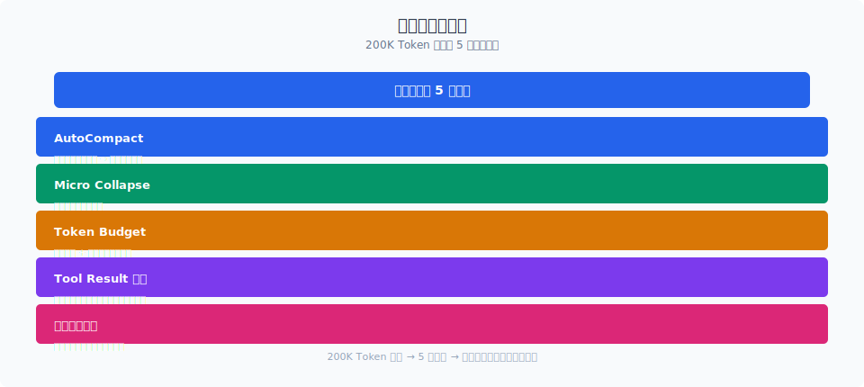

# 微压缩与折叠

> microcompact 和 contextCollapse 是 5 层压缩的中间两环。microcompact 用 tool_use_id 做"点状压缩"，contextCollapse 用 collapse store 做"面状归档"。两者都不依赖 LLM 做决策，但效果惊人。

你好，我是江小湖。

上一篇 [自动压缩](./02-autocompact.md) 讲到 autocompact 的触发阈值和熔断机制。这一篇深入中间两层：microcompact 和 contextCollapse。

## 目录

- [microcompact：by tool_use_id 的点状压缩](#microcompactby-tool_use_id-的点状压缩)
- [时间衰减策略](#时间衰减策略)
- [Cached Microcompact（Ant 内部）](#cached-microcompactant-内部)
- [contextCollapse：跨轮次持久化的面状归档](#contextcollapse跨轮次持久化的面状归档)
- [collapse store 的事务模型](#collapse-store-的事务模型)
- [总结](#总结)
- [参考链接](#参考链接)

<p align="center">
  
  <br/>
  <em>200K Token 窗口的 5 层压缩机制</em>
</p>


<p align="center">
  
  <br/>
  <em>Claude Code 源码解析 07-context-engineering 配图</em>
</p>
## microcompact：by tool_use_id 的点状压缩

microcompact 的设计非常简洁——它只做一件事：**找到某个 tool_use_id 对应的结果消息，把它替换成短摘要。**

```typescript
// microCompact.ts — 概念逻辑
function microcompact(messages: Message[], targetToolUseId: string): Message[] {
  return messages.map(msg => {
    if (msg.type === 'user' && msg.toolUseResult?.tool_use_id === targetToolUseId) {
      // 替换为压缩后的简短摘要
      return createUserMessage({
        content: `[Tool result summarized: ${summarize(msg.content)}]`,
        toolUseResult: summarize(msg.content),
      })
    }
    return msg
  })
}
```

它只认 `tool_use_id`，不检查消息内容。这和 `applyToolResultBudget`（按字符数截断）形成正交——两者可以安全组合。

### 什么不会被压缩

microcompact 有白名单（`COMPACTABLE_TOOLS`），只压缩特定类型的工具结果。EditTool、WriteTool 的输出通常只有"File updated successfully"这样的简短确认，压缩毫无意义。

图片类型的 tool result 会被特殊处理——最多保留 2000 token 的占位符（`IMAGE_MAX_TOKEN_SIZE`）。

## 时间衰减策略

`timeBasedMCConfig` 定义了一个基于时间的压缩策略：

```typescript
// timeBasedMCConfig.ts — 概念
function getTimeBasedMCConfig(): TimeBasedMCConfig {
  return {
    // 最近 5 轮对话的工具结果不压缩
    preserveRecentTurns: 5,
    // 5-15 轮之间用轻度压缩（保留关键信息）
    lightCompactTurns: { from: 5, to: 15 },
    // 15 轮之后的工具结果做深度压缩
    deepCompactTurns: { from: 15 },
  }
}
```

这个策略基于一个洞察：**最近的消息更有用。** 5 轮前的工具输出大概率已经被模型消化了，压缩它不影响后续决策。

## Cached Microcompact（Ant 内部）

Claude Code 的 Ant 内部版本支持"缓存微压缩"（`cachedMicrocompact.ts`）：

```
传统 microcompact:
  每次循环 → 扫描消息列表 → 压缩符合条件的 tool result → 每次都要做

Cached microcompact:
  首次压缩 → 记录压缩结果 → 后续循环直接复用 → 通过 cache_edits 增量更新
```

缓存的压缩结果通过 `pendingCacheEdits` 和 `notifyCacheDeletion` 维护增量更新。如果模型在压缩后又引用了之前的结果内容，缓存自动失效——防止"模型需要的信息被压缩掉了"。

这个优化对长会话（100+ 轮）尤其有效，因为消息列表中的大部分内容都是"旧结果"，每次重新扫描和压缩的开销会线性增长。

## contextCollapse：跨轮次持久化的面状归档

contextCollapse 解决的不是"单个结果太大"，而是"轮次太多导致消息数量爆炸"。

它的核心是 collapse store——一个提交日志（commit log），记录每次折叠操作：

```typescript
// 概念示意
const collapseStore = {
  commits: [
    { turn: 15, archivedMessages: [msg1, msg2, msg3], summary: '用户配置了数据库连接...' },
    { turn: 30, archivedMessages: [msg4, msg5], summary: '修复了三个 API 端点...' },
  ]
}

// 每次进入循环时，重放 collapse store 重建当前视图
function projectView(messages, collapseStore) {
  return messages.filter(msg => !isArchived(msg, collapseStore))
}
```

这个设计的精妙之处：**压缩效果跨轮次持久化。**

即使当前循环没有触发新的折叠，之前的折叠仍然有效。这避免了每次循环都要重新做"这段对话要不要折叠"的判断——之前折叠过的内容不会再回来。

## collapse store 的事务模型

collapse store 的操作是事务性的：

1. **提交**：把一段对话归档，生成摘要，写入 commit 日志
2. **回滚**：如果后续发现"这段归档信息还需要"，可以从 commit log 中恢复（通过 sidechain 记录）
3. **重放**：每次构造消息列表时，重放整个 commit log 过滤已归档消息

```typescript
// compact.ts — runPostCompactCleanup
export function runPostCompactCleanup(state) {
  // autocompact 成功后，清除 collapse store
  // 因为 autocompact 已经做了全局总结，collapse 级别的归档就多余了
  resetContextCollapse()
}
```

注意：**autocompact 成功后会清除 collapse store**。因为全对话总结已经覆盖了所有折叠内容，再保留 collapse 级别的归档只会造成重复信息。

## 总结

- microcompact 按 `tool_use_id` 做点状压缩，和白名单工具类型配合，不压缩 EditTool/WriteTool 等已有简洁输出的工具。
- 时间衰减策略按"最近 5 轮 → 5-15 轮 → 15 轮以上"递进压缩强度。
- Cached microcompact 通过缓存压缩结果和增量更新，对 100+ 轮长会话效果显著。
- contextCollapse 用 commit log 做面状归档，压缩效果跨轮次持久化。
- collapse store 事务支持提交/回滚/重放，autocompact 成功后自动清除。

> 下一篇：[预算与熔断](./04-budget.md)，看 Token 预算分配和成本控制如何在工程层面落地。

## 参考链接

- [Claude Code microCompact.ts 源码](file:///E:/Projects/claude-code/src/services/compact/microCompact.ts)
- [Claude Code compact.ts — contextCollapse](file:///E:/Projects/claude-code/src/services/compact/compact.ts)
- [Claude Code timeBasedMCConfig.ts](file:///E:/Projects/claude-code/src/services/compact/timeBasedMCConfig.ts)
