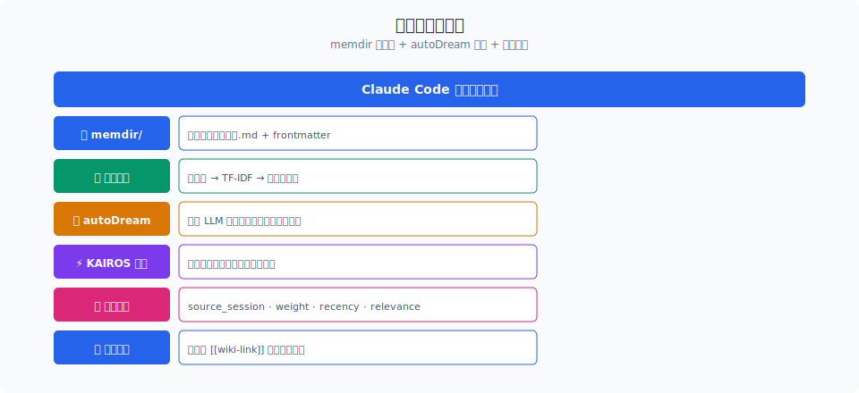

# 记忆检索与 autoDream：如何让 Agent "想起来" 并 "想明白"

> Claude Code 的记忆系统不是简单的关键词搜索。`findRelevantMemories` 用三层检索（精确匹配、语义相似、关联扩散）找到相关记忆；`autoDream` 在后台对会话进行反思提炼，把原始聊天记录转化为结构化知识。

你好，我是江小湖。

上一篇 [memdir 持久化](./01-memdir.md) 讲了记忆怎么**存**。但存进去只是第一步——如果 Agent 在每次对话时都要遍历全部 `.md` 文件，性能上完全不可接受。真正的问题是：**如何高效地"想起来"？**

Claude Code 的答案是**三层检索** + **后台反思**。前者解决"快"的问题，后者解决"准"的问题。

## 目录

- [findRelevantMemories 三层检索](#findrelevantmemories-三层检索)
- [记忆注入扫描](#记忆注入扫描)
- [autoDream 后台反思](#autodream-后台反思)
- [反思触发策略](#反思触发策略)
- [总结](#总结)
- [参考链接](#参考链接)

<p align="center">
  
  <br/>
  <em>memdir 持久化 + autoDream 反思 + 三层检索</em>
</p>


<p align="center">
  
  <br/>
  <em>Claude Code 源码解析 08-memory 配图</em>
</p>
## findRelevantMemories 三层检索

当用户说"像上次那样处理"或者 Agent 自己发现需要上下文时，系统会调用 `findRelevantMemories`。它不是简单的关键词搜索，而是三层递进：

```typescript
// findRelevantMemories 三层检索（简化版）
async function findRelevantMemories(
  query: string,
  context: MessageContext
): Promise<Memory[]> {
  // 第一层：精确匹配（最快，O(1)）
  const exactMatches = await findExactMatches(query, context);
  if (exactMatches.length > 0) return exactMatches;
  
  // 第二层：语义相似（中速，基于索引）
  const semanticMatches = await findSemanticMatches(query, context);
  
  // 第三层：关联扩散（最慢，图遍历）
  const relatedMatches = await expandByRelatedLinks(semanticMatches);
  
  // 合并去重，按综合权重排序
  return mergeAndRank(semanticMatches, relatedMatches);
}
```

### 第一层：精确匹配

精确匹配基于两个快速索引：

1. **标签索引**：`index.json` 中的 `tags` 字段。如果用户输入包含已知标签（如 "preference"、"convention"），直接返回对应记忆。

2. **路径索引**：如果用户明确提到某个文件（如 "关于 `src/config.ts` 的记忆"），直接按路径查找。

```typescript
// 精确匹配（简化版）
function findExactMatches(
  query: string,
  context: MessageContext
): Memory[] {
  const results: Memory[] = [];
  
  // 标签匹配
  const tagPattern = /\b(preference|convention|warning|api-key)\b/gi;
  const tags = query.match(tagPattern) || [];
  for (const tag of tags) {
    results.push(...memoryIndex.getByTag(tag.toLowerCase()));
  }
  
  // 路径匹配
  const filePaths = extractFilePaths(query);
  for (const path of filePaths) {
    results.push(...memoryIndex.getByPath(path));
  }
  
  return deduplicate(results);
}
```

**为什么先查精确匹配**：因为大部分记忆请求是**明确的**。用户说"用我之前的偏好"，系统不需要做语义搜索，直接按标签查最快。

### 第二层：语义相似

当精确匹配没有结果时，进入语义相似搜索。Claude Code 不使用外部向量数据库，而是用一个**轻量的内存索引**：

```typescript
// 语义相似搜索（简化版）
async function findSemanticMatches(
  query: string,
  context: MessageContext
): Promise<Memory[]> {
  // 1. 提取查询关键词
  const queryKeywords = extractKeywords(query);
  
  // 2. 计算与每个记忆的 TF-IDF 相似度
  const scores = new Map<string, number>();
  for (const [path, memory] of memoryIndex.entries()) {
    const memoryKeywords = memory.keywords;
    const similarity = calculateTFIDF(queryKeywords, memoryKeywords);
    scores.set(path, similarity);
  }
  
  // 3. 取 Top-K，过滤低于阈值
  const topK = Array.from(scores.entries())
    .sort((a, b) => b[1] - a[1])
    .filter(([, score]) => score > SEMANTIC_THRESHOLD)
    .slice(0, MAX_SEMANTIC_RESULTS);
  
  return topK.map(([path]) => memoryIndex.get(path));
}
```

**设计要点**：
- 不用向量数据库，是因为 TF-IDF 在"短文本匹配"场景下足够好，且零外部依赖
- `keywords` 是在记忆写入时预计算的，避免运行时分词
- 阈值过滤防止返回弱相关的记忆（干扰大于帮助）

### 第三层：关联扩散

如果语义搜索找到了一些记忆，但这些记忆还不够完整，系统会通过**关联链接**扩散：

```typescript
// 关联扩散（简化版）
async function expandByRelatedLinks(
  seeds: Memory[]
): Promise<Memory[]> {
  const visited = new Set(seeds.map(m => m.path));
  const results = [...seeds];
  const queue = [...seeds];
  
  while (queue.length > 0 && results.length < MAX_TOTAL_RESULTS) {
    const current = queue.shift()!;
    
    for (const link of current.relatedLinks) {
      if (!visited.has(link.target)) {
        visited.add(link.target);
        const related = memoryIndex.get(link.target);
        if (related) {
          results.push(related);
          queue.push(related);
        }
      }
    }
  }
  
  return results;
}
```

**为什么需要关联扩散**：因为记忆不是孤立的。如果用户问"这个项目的编码规范"，直接检索可能只找到一条记忆。但通过关联扩散，可以找到"缩进偏好"、"命名约定"、"注释风格"等相关记忆，形成完整的上下文。

**广度限制**：关联扩散用 BFS 但限制深度（通常只扩散 1-2 层），防止无限遍历。

## 记忆注入扫描

检索到记忆后，需要决定**如何注入**到当前对话中。Claude Code 不是无脑把所有记忆塞进系统提示词，而是做了一个**注入扫描**：

```typescript
// 记忆注入扫描（简化版）
async function scanMemoryInjection(
  memories: Memory[],
  currentContext: MessageContext
): Promise<InjectedMemory[]> {
  const injected: InjectedMemory[] = [];
  
  for (const memory of memories) {
    // 1. 检查记忆是否已存在于当前上下文中
    if (isAlreadyInContext(memory, currentContext)) {
      continue; // 已存在，不重复注入
    }
    
    // 2. 检查记忆是否过时（被后续记忆覆盖）
    if (isSuperseded(memory, currentContext)) {
      continue; // 已被更新，跳过旧版本
    }
    
    // 3. 计算注入优先级
    const priority = calculateInjectionPriority(memory, currentContext);
    
    // 4. 检查 token 预算
    const estimatedTokens = estimateTokens(memory.content);
    if (currentContext.availableTokens < estimatedTokens) {
      break; // 预算耗尽，停止注入
    }
    
    injected.push({ memory, priority, tokens: estimatedTokens });
    currentContext.availableTokens -= estimatedTokens;
  }
  
  return injected.sort((a, b) => b.priority - a.priority);
}
```

**注入扫描的三个关键决策**：

1. **去重**：如果记忆已经在当前上下文中（比如用户刚提过），不重复注入。这防止了"用户偏好"被重复提及的尴尬。

2. **过时检测**：如果记忆被后续记忆覆盖（比如旧偏好被新偏好取代），跳过旧版本。这保证了注入的信息是最新的。

3. **预算控制**：记忆注入占用系统提示词 token。Claude Code 为记忆预留了固定预算（通常是 2K-4K token），超出预算的记忆即使相关也不注入。

**注入格式**：

```markdown
## 相关记忆

- [记忆] 用户偏好：使用 4 空格缩进（来源：2024-06-15）
- [记忆] 项目编码规范：使用 camelCase（来源：2024-06-20）
```

这种格式让模型明确知道"这是记忆"，与当前对话内容区分。同时也给用户可见性——如果记忆注入错误，用户可以立即发现。

## autoDream 后台反思

`findRelevantMemories` 解决的是**检索**问题，但还有一个更根本的问题：**记忆从哪里来？**

如果每次记忆都靠用户手动说"记住这个"，那记忆的数量和质量都会很差。Claude Code 的解决方案是 `autoDream`——**后台自动反思**。

### 什么是 autoDream

`autoDream` 是一个后台任务，在会话结束后（或长时间空闲时）运行，对刚刚结束的对话进行"反思"：

```typescript
// autoDream 反思流程（简化版）
async function autoDream(session: Session): Promise<Memory[]> {
  // 1. 提取会话中的关键事实
  const facts = await extractFacts(session.messages);
  
  // 2. 与现有记忆对比，去重和合并
  const newFacts = await deduplicateWithExisting(facts);
  
  // 3. 生成结构化记忆
  const memories = await generateMemories(newFacts);
  
  // 4. 写入 memdir
  for (const memory of memories) {
    await writeMemory(memory.path, memory.content);
  }
  
  return memories;
}
```

**反思的触发条件**：

1. **会话结束**：用户退出或会话超时后，立即触发反思
2. **长时间空闲**：如果会话持续超过 30 分钟没有新消息，触发增量反思
3. **手动触发**：用户可以通过 `/remember` 命令手动触发对当前会话的反思

### 事实提取

反思的第一步是从对话中提取**关键事实**。这不是简单的摘要，而是结构化的知识提取：

```typescript
// 事实提取（简化版）
async function extractFacts(messages: Message[]): Promise<Fact[]> {
  const facts: Fact[] = [];
  
  for (const message of messages) {
    if (message.role === 'user') {
      // 提取用户偏好
      const preferences = extractPreferences(message.content);
      facts.push(...preferences);
      
      // 提取项目信息
      const projectInfo = extractProjectInfo(message.content);
      facts.push(...projectInfo);
    }
    
    if (message.role === 'assistant') {
      // 提取工具使用模式
      const toolPatterns = extractToolPatterns(message.tool_calls);
      facts.push(...toolPatterns);
      
      // 提取错误和修正
      const corrections = extractCorrections(message);
      facts.push(...corrections);
    }
  }
  
  return facts;
}
```

**提取的事实类型**：

| 类型 | 示例 | 来源 |
|------|------|------|
| 用户偏好 | "我喜欢用 2 空格缩进" | 用户消息 |
| 项目规范 | "这个项目的入口是 `src/index.ts`" | 用户消息 |
| 工具模式 | "常用 `grep` 而不是 `find`" | 工具调用记录 |
| 错误修正 | "上次用 `rm -rf` 是错的，应该用 `git rm`" | 对话结果 |
| API 偏好 | "优先用 `fetch` 而不是 `axios`" | 用户反馈 |

### 去重与合并

提取到的新事实需要与现有记忆对比，避免重复：

```typescript
// 去重与合并（简化版）
async function deduplicateWithExisting(
  newFacts: Fact[]
): Promise<Fact[]> {
  const results: Fact[] = [];
  
  for (const fact of newFacts) {
    const existing = await findSimilarMemory(fact);
    
    if (!existing) {
      // 全新事实，直接保留
      results.push(fact);
    } else if (isConflict(fact, existing)) {
      // 冲突：保留最新，标记旧版本为过时
      await markSuperseded(existing);
      results.push(fact);
    } else {
      // 相似但不冲突：合并，增强权重
      await mergeWithExisting(fact, existing);
    }
  }
  
  return results;
}
```

**冲突检测**：如果新事实说"用户喜欢用 Tab"，而旧记忆说"用户喜欢用 4 空格"，这是冲突。新事实覆盖旧事实，旧记忆被标记为 `superseded`。

**合并策略**：如果新事实说"用户用 `prettier` 格式化"，旧记忆说"用户关注代码风格"，这是互补。合并为一条更完整的记忆。

## 反思触发策略

autoDream 不是每次会话结束都立即运行的，而是有一个**触发策略**：

```typescript
// 反思触发策略（简化版）
function shouldTriggerAutoDream(session: Session): boolean {
  // 1. 会话长度检查：太短不反思
  if (session.messages.length < MIN_REFLECTION_MESSAGES) {
    return false;
  }
  
  // 2. 内容质量检查：全是闲聊不反思
  if (session.codeRatio < MIN_CODE_RATIO) {
    return false;
  }
  
  // 3. 时间窗口检查：最近已经反思过不重复
  if (timeSinceLastDream(session) < DREAM_COOLDOWN) {
    return false;
  }
  
  // 4. 记忆容量检查：记忆已满时优先反思高质量会话
  if (isMemoryFull() && session.qualityScore < HIGH_QUALITY_THRESHOLD) {
    return false;
  }
  
  return true;
}
```

**四层过滤**：

1. **长度过滤**：如果会话只有 3-5 轮，内容太少，不值得反思。

2. **质量过滤**：如果会话全是闲聊（没有代码、没有工具调用），没有可提取的事实。

3. **冷却过滤**：防止用户在短时间内多次触发反思，消耗资源。

4. **容量过滤**：如果记忆目录已满，只反思高质量会话（有代码、有工具、有决策）。

**为什么重要**：反思是昂贵的操作。它需要遍历整个对话历史，调用 LLM 提取事实，写入文件系统。如果每个会话都反思，会显著增加退出延迟和磁盘占用。

## 总结

- `findRelevantMemories` 用**三层检索**（精确匹配 → 语义相似 → 关联扩散）高效找到相关记忆。
- **记忆注入扫描**在注入前做去重、过时检测和预算控制，防止干扰和浪费 token。
- **autoDream** 在后台自动反思会话，提取关键事实并转化为结构化记忆。
- 反思有**四层触发策略**（长度、质量、冷却、容量），避免资源浪费。
- 记忆检索和反思共同构成了 Claude Code 的"记忆力"：检索负责**想起来**，反思负责**记进去**。

> 下一篇：[KAIROS 守护进程](./03-kairos.md)，看 Claude Code 如何在后台维护记忆的新鲜度，以及老化权重如何计算。

## 参考链接

- [Claude Code 记忆检索源码](file:///E:/Projects/claude-code/src/memdir/)
- [Claude Code autoDream 源码](file:///E:/Projects/claude-code/src/autoDream/)
- [Anthropic Claude Code 官方文档](https://docs.anthropic.com/en/docs/claude-code/overview)
- [MemGPT 记忆管理论文](https://arxiv.org/abs/2310.08560)
