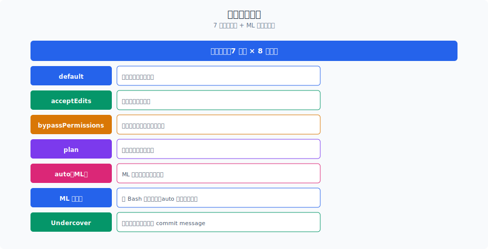
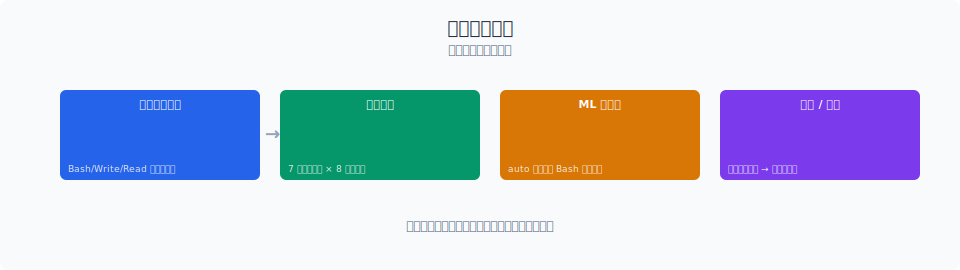

# 三层防护：Claude Code 如何把危险操作锁在笼子里

> Claude Code 的权限系统不是"一个开关"，而是三道防线：注册过滤、调用检查、交互询问。任何危险操作必须通过全部三层才能执行——即使某一层被绕过，下一层 still 能拦住。

你好，我是江小湖。

上一章 [子 Agent](../09-subagent/README.md) 讲到 AgentTool 如何让子 Agent 在隔离环境中工作。但隔离只是"空间隔离"——子 Agent 仍然可以执行危险操作（比如删除文件）。如果权限控制不严，隔离就形同虚设。

Claude Code 的权限系统有三层防护，每层都在回答一个不同的问题：

| 防线 | 问题 | 时机 |
|------|------|------|
| **注册过滤** | "这个工具在当前模式下是否可用？" | 工具注册时 |
| **调用检查** | "这次调用是否符合权限规则？" | 工具执行前 |
| **交互询问** | "用户是否同意这次操作？" | 需要确认时 |

三层防线串联，任何一层拒绝，操作就无法执行。

## 目录

- [第一层：注册过滤](#第一层注册过滤)
- [第二层：调用检查](#第二层调用检查)
- [第三层：交互询问](#第三层交互询问)
- [三层联防的工作流程](#三层联防的工作流程)
- [性能与安全的平衡](#性能与安全的平衡)
- [总结](#总结)
- [参考链接](#参考链接)

<p align="center">
  
  <br/>
  <em>7 种权限模式 + ML 安全分类器</em>
</p>


<p align="center">
  
  <br/>
  <em>Claude Code 源码解析 10-permissions 配图</em>
</p>
## 第一层：注册过滤

注册过滤发生在**工具注册阶段**——当 Claude Code 启动时，每个工具向系统注册自己的权限需求。系统根据当前的运行模式，决定哪些工具可以被激活。

```typescript
// 工具注册与权限过滤（简化版）
interface ToolRegistration {
  name: string;
  permissionLevel: 'read' | 'safe_write' | 'dangerous';
  requiredMode: PermissionMode[];
  category: 'file' | 'bash' | 'network' | 'agent';
}

// 工具注册表
const TOOL_REGISTRY: ToolRegistration[] = [
  { name: 'read_file', permissionLevel: 'read', requiredMode: ['default', 'auto', 'plan'], category: 'file' },
  { name: 'edit_file', permissionLevel: 'safe_write', requiredMode: ['default', 'auto', 'plan'], category: 'file' },
  { name: 'bash', permissionLevel: 'dangerous', requiredMode: ['default', 'plan'], category: 'bash' },
  { name: 'delete_file', permissionLevel: 'dangerous', requiredMode: ['default'], category: 'file' },
  { name: 'send_email', permissionLevel: 'dangerous', requiredMode: ['default'], category: 'network' },
  { name: 'agent_tool', permissionLevel: 'dangerous', requiredMode: ['default', 'plan'], category: 'agent' },
];

// 注册过滤：根据当前模式过滤可用工具
function filterToolsByMode(
  tools: ToolRegistration[],
  currentMode: PermissionMode
): ToolRegistration[] {
  return tools.filter(tool => {
    // 检查工具是否支持当前模式
    if (!tool.requiredMode.includes(currentMode)) {
      console.log(`工具 ${tool.name} 在当前模式 ${currentMode} 下不可用`);
      return false;
    }
    return true;
  });
}
```

**注册过滤的设计要点**：

1. **声明式权限**：每个工具在注册时声明自己的权限级别（`read` / `safe_write` / `dangerous`）和支持的模式。这不是运行时检查，而是**静态声明**。

2. **模式过滤**：某些工具在特定模式下完全被禁用。比如 `delete_file` 在 `auto` 模式下不可用——因为自动模式不应该执行不可逆操作。

3. **提前失败**：注册过滤在启动时执行，而不是在工具调用时。这意味着如果当前模式不支持某个工具，工具根本不会出现在 Agent 的可用工具列表中。模型看不到这个工具，自然就不会调用。

**为什么不用运行时检查**：如果把权限检查放在工具调用阶段，模型已经生成了调用意图，只是在执行前被拦截。这种情况下模型可能"困惑"——它以为这个工具可用，结果调用失败。注册过滤在更早的阶段移除工具，让模型在生成调用时就知道哪些工具不可用。

## 第二层：调用检查

调用检查发生在**工具执行前**——即使工具已经注册并可用，每次调用时还要做细粒度的检查。

```typescript
// 调用检查（简化版）
interface InvocationCheck {
  tool: string;
  args: Record<string, unknown>;
  context: ExecutionContext;
}

async function checkInvocation(
  invocation: InvocationCheck
): Promise<PermissionDecision> {
  const { tool, args, context } = invocation;
  
  // 1. 检查参数级约束
  const paramCheck = await checkParameterConstraints(tool, args);
  if (!paramCheck.allowed) {
    return { decision: 'deny', reason: paramCheck.reason };
  }
  
  // 2. 检查路径级约束（针对文件操作）
  if (isFileTool(tool)) {
    const pathCheck = await checkPathConstraints(args.path, context);
    if (!pathCheck.allowed) {
      return { decision: 'deny', reason: pathCheck.reason };
    }
  }
  
  // 3. 检查速率限制
  const rateCheck = await checkRateLimit(tool, context);
  if (!rateCheck.allowed) {
    return { decision: 'deny', reason: 'Rate limit exceeded' };
  }
  
  // 4. 检查上下文约束（如不允许在子 Agent 中执行某些操作）
  if (context.isSubAgent && isRestrictedForSubAgent(tool)) {
    return { decision: 'deny', reason: 'Operation restricted in sub-agent context' };
  }
  
  return { decision: 'allow' };
}
```

**调用检查的四层验证**：

### 1. 参数级约束

每个工具的参数都有约束规则。比如 `bash` 工具的 `command` 参数：

```typescript
// Bash 命令参数约束（简化版）
function checkBashCommandConstraints(command: string): ConstraintCheck {
  // 1. 长度限制：防止注入超长命令
  if (command.length > MAX_COMMAND_LENGTH) {
    return { allowed: false, reason: 'Command too long' };
  }
  
  // 2. 禁止命令列表：18 个危险命令直接拒绝
  const forbiddenCommands = [
    'rm -rf /', 'rm -rf /*', 'format', 'fdisk',
    'mkfs', 'dd if=/dev/zero', '>:', 'bash -i',
    'nc -e', 'python -m http.server', 'curl | bash',
    // ... 共 18 个
  ];
  
  for (const forbidden of forbiddenCommands) {
    if (command.includes(forbidden)) {
      return { allowed: false, reason: `Forbidden command pattern: ${forbidden}` };
    }
  }
  
  // 3. 路径遍历检测：防止 ../../etc/passwd
  if (command.includes('../') || command.includes('..\\')) {
    return { allowed: false, reason: 'Path traversal detected' };
  }
  
  return { allowed: true };
}
```

**18 个禁止命令**覆盖了最常见的危险操作模式。这不是靠正则匹配，而是**精确字符串匹配**——避免误杀合法命令。比如 `rm -rf ./build` 是合法的（清理构建目录），但 `rm -rf /` 是致命的。

### 2. 路径级约束

文件操作工具（`read_file`、`edit_file`、`delete_file`）需要检查路径是否合法：

```typescript
// 路径约束检查（简化版）
async function checkPathConstraints(
  filePath: string,
  context: ExecutionContext
): Promise<ConstraintCheck> {
  const resolvedPath = path.resolve(context.cwd, filePath);
  
  // 1. 检查路径是否在允许的根目录内
  const allowedRoots = await getAllowedRoots(context);
  const isInAllowedRoot = allowedRoots.some(root => 
    resolvedPath.startsWith(root)
  );
  
  if (!isInAllowedRoot) {
    return { allowed: false, reason: 'Path outside allowed directories' };
  }
  
  // 2. 检查是否是敏感文件
  const sensitiveFiles = [
    '.env', '.ssh/id_rsa', 'id_rsa', '.aws/credentials',
    'credentials.json', 'token', 'secret',
  ];
  
  const basename = path.basename(resolvedPath).toLowerCase();
  if (sensitiveFiles.some(s => basename.includes(s))) {
    return { allowed: false, reason: 'Access to sensitive file denied' };
  }
  
  // 3. 检查文件大小（防止读取超大文件撑爆上下文）
  const stats = await fs.stat(resolvedPath).catch(() => null);
  if (stats && stats.size > MAX_FILE_SIZE) {
    return { allowed: false, reason: `File too large: ${stats.size} bytes` };
  }
  
  return { allowed: true };
}
```

**路径约束的三个维度**：
- **根目录限制**：子 Agent 只能在自己的 Worktree 内操作，不能访问父工作区之外的文件。
- **敏感文件保护**：`.env`、SSH 密钥、AWS 凭证等文件即使可读，也被标记为敏感，需要额外确认。
- **大小限制**：读取超过 500KB 的文件会被拒绝，防止超大文件撑爆上下文。

### 3. 速率限制

某些工具（如网络请求、API 调用）有速率限制，防止滥用：

```typescript
// 速率限制（简化版）
class RateLimiter {
  private counters = new Map<string, { count: number; resetTime: number }>();
  
  async checkRateLimit(tool: string, context: ExecutionContext): Promise<ConstraintCheck> {
    const key = `${context.sessionId}:${tool}`;
    const now = Date.now();
    const counter = this.counters.get(key) || { count: 0, resetTime: now + RATE_WINDOW };
    
    if (now > counter.resetTime) {
      // 重置窗口
      counter.count = 0;
      counter.resetTime = now + RATE_WINDOW;
    }
    
    const limit = getRateLimit(tool); // 不同工具有不同限制
    if (counter.count >= limit) {
      return { allowed: false, reason: `Rate limit: ${tool} exceeded ${limit} calls per minute` };
    }
    
    counter.count++;
    this.counters.set(key, counter);
    return { allowed: true };
  }
}
```

### 4. 上下文约束

某些操作在特定上下文中被限制。比如子 Agent 不能执行 `git push`（防止推送未审核的代码），不能删除父工作区的文件（即使路径在 Worktree 内，如果是符号链接指向父目录的文件也会被拦截）。

## 第三层：交互询问

前两道防线是**自动的**——不需要用户参与。但某些操作即使通过了前两层的检查，仍然需要**用户确认**。这是第三层：交互询问。

```typescript
// 交互询问（简化版）
async function interactiveConfirmation(
  invocation: InvocationCheck
): Promise<ConfirmationResult> {
  const { tool, args, context } = invocation;
  
  // 1. 判断是否需要确认
  const needConfirmation = await needsUserConfirmation(invocation);
  if (!needConfirmation) {
    return { confirmed: true, source: 'auto' };
  }
  
  // 2. 构建确认提示
  const prompt = buildConfirmationPrompt(invocation);
  
  // 3. 向用户展示确认对话框
  const userResponse = await showConfirmationDialog(prompt);
  
  // 4. 记录确认决策（用于审计）
  await logPermissionDecision({
    tool,
    args,
    decision: userResponse.confirmed ? 'approved' : 'denied',
    timestamp: Date.now(),
    user: context.userId,
  });
  
  return userResponse;
}
```

**需要确认的场景**：

| 操作类型 | 示例 | 确认级别 |
|----------|------|----------|
| **不可逆写入** | `delete_file`、`rm` | 必须确认 |
| **网络外发** | `send_email`、`curl` | 必须确认 |
| **敏感文件** | 读取 `.env`、SSH 密钥 | 必须确认 |
| **大规模修改** | 修改超过 10 个文件 | 建议确认 |
| **Bash 命令** | 包含管道、重定向 | 必须确认 |
| **子 Agent 创建** | `agent_tool` 调用 | 视模式而定 |

**确认提示的构建**：

Claude Code 不是简单地弹出一个"是否允许？"的对话框，而是展示**操作的具体细节**：

```
⚠️  Claude Code 请求执行以下操作：

工具: delete_file
文件: src/old-component.tsx (1,234 bytes)

这是不可逆操作。删除后文件将无法恢复。

[允许]  [拒绝]  [始终允许此类操作]
```

**设计要点**：
- **具体化**：显示文件路径、大小、操作类型，而不是模糊的"执行操作"
- **后果提示**：说明这是"不可逆"的，让用户理解风险
- **快捷选项**：提供"始终允许此类操作"，避免重复确认相同的操作类型（但记录到日志中）
- **时间限制**：确认对话框有超时（如 5 分钟），超时后默认拒绝，防止用户离开后无人看管

## 三层联防的工作流程

一个工具调用从生成到执行的完整流程：

```
模型生成工具调用意图
        ↓
第一层：注册过滤
- 检查工具是否在当前模式下注册
- 如果未注册 → 拒绝，模型收到"工具不可用"错误
        ↓（通过）
第二层：调用检查
- 参数级约束验证
- 路径级约束验证
- 速率限制检查
- 上下文约束验证
- 任何一项失败 → 拒绝，返回具体原因
        ↓（通过）
第三层：交互询问
- 判断是否需要用户确认
- 如果需要 → 展示确认对话框
- 用户拒绝 → 拒绝
- 用户超时 → 默认拒绝
        ↓（通过）
执行工具调用
        ↓
记录审计日志
```

**三层联防的安全性质**：

- **纵深防御**：即使某一层被绕过（如注册过滤的 bug），下一层 still 能拦住。三层同时失效的概率极低。
- **最小权限**：每一层都遵循"默认拒绝"原则——如果无法确定是否允许，就拒绝。
- **可审计**：每个决策（允许/拒绝）都被记录到日志中，包括时间、用户、工具、参数、决策原因。

## 性能与安全的平衡

权限检查是每次工具调用都要执行的，性能不能忽视。Claude Code 在性能和安全之间做了几个取舍：

```typescript
// 性能优化：缓存权限检查结果（简化版）
class PermissionCache {
  private cache = new Map<string, CacheEntry>();
  
  getCacheKey(tool: string, args: Record<string, unknown>, context: ExecutionContext): string {
    // 只缓存与权限相关的参数
    const permissionRelevantArgs = pick(args, ['path', 'command', 'url']);
    return `${tool}:${JSON.stringify(permissionRelevantArgs)}:${context.sessionId}`;
  }
  
  async checkWithCache(invocation: InvocationCheck): Promise<PermissionDecision> {
    const key = this.getCacheKey(invocation.tool, invocation.args, invocation.context);
    const cached = this.cache.get(key);
    
    if (cached && !cached.isExpired()) {
      return cached.decision; // 缓存命中，O(1)
    }
    
    // 缓存未命中，执行完整检查
    const decision = await performFullCheck(invocation);
    this.cache.set(key, new CacheEntry(decision, CACHE_TTL));
    return decision;
  }
}
```

**性能优化策略**：

1. **缓存权限检查结果**：对于相同的工具 + 参数组合，缓存检查结果（TTL 5 分钟）。比如连续读取同一个文件，第二次不需要重复检查路径约束。

2. **分层检查顺序**：把最快的检查放在最前面。注册过滤在启动时完成（零运行时开销）。调用检查时，先查参数约束（字符串匹配，O(1)），再查路径约束（需要文件系统操作，O(n)），最后查速率限制（需要计数器操作，O(1)）。

3. **异步检查**：交互询问天然是异步的（等待用户响应），但前两层的自动检查可以并行执行。比如路径约束检查和速率限制检查可以同时进行。

4. **预编译规则**：18 个禁止命令和敏感文件列表在启动时编译成 Trie 树，匹配从 O(n) 优化到 O(m)（m 是命令长度）。

## 总结

- Claude Code 的权限系统是**三层纵深防御**：注册过滤（工具注册时）→ 调用检查（工具执行前）→ 交互询问（需要确认时）。
- **注册过滤**在启动时根据运行模式过滤可用工具，让模型在生成调用前就知道工具是否可用。
- **调用检查**有四层验证：参数约束（18 个禁止命令）、路径约束（根目录限制 + 敏感文件保护）、速率限制、上下文约束。
- **交互询问**在用户层面做最后把关，展示具体操作细节和后果，提供"始终允许"快捷选项。
- **性能优化**通过缓存、分层检查顺序、异步并行和预编译规则，确保权限检查不成为性能瓶颈。

> 下一篇：[7 模式 8 优先级](./02-modes-priority.md)，看 Claude Code 的 7 种运行模式和 8 级优先级如何组合出灵活的权限控制策略。

## 参考链接

- [Claude Code 权限系统源码](file:///E:/Projects/claude-code/src/utils/permissions/)
- [Claude Code 工具注册过滤](file:///E:/Projects/claude-code/src/tools.ts)
- [Anthropic Claude Code 官方文档](https://docs.anthropic.com/en/docs/claude-code/overview)
