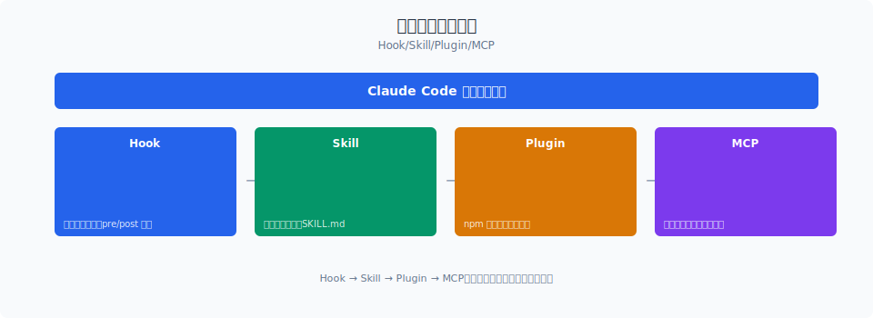

# Skill 系统：Claude Code 的"可复用工作流"

> Claude Code 的 Skill 系统不是"添加新工具"，而是"组合已有工具完成标准化流程"。一个 Skill 是声明式的工作流定义——它描述"做什么"，Claude Code 的引擎负责"怎么做"。这让团队可以把最佳实践编码成可复用的工作流。

你好，我是江小湖。

上一篇 [四种扩展方式对比](./01-extension-types.md) 讲到 Skill 是 Claude Code 的"官方推荐扩展方式"。但"官方推荐"不等于"理解到位"——Skill 不是 Plugin，不是 Hook，它是一个独立的概念。要理解 Skill，先回答一个问题：**Skill 和工具有什么区别？**

## 目录

- [Skill 与工具的区别](#skill-与工具的区别)
- [Skill 的注册与发现](#skill-的注册与发现)
- [Skill 的触发机制](#skill-的触发机制)
- [Skill 的执行引擎](#skill-的执行引擎)
- [Skill 的实战示例](#skill-的实战示例)
- [Skill 的治理与版本](#skill-的治理与版本)
- [总结](#总结)
- [参考链接](#参考链接)

<p align="center">
  
  <br/>
  <em>Hook → Skill → Plugin → MCP</em>
</p>


## Skill 与工具的区别

很多人把 Skill 和工具混为一谈，但它们是完全不同的东西：

| 维度 | 工具（Tool） | Skill |
|------|------------|-------|
| **本质** | 原子能力 | 工作流编排 |
| **例子** | `read_file`、`edit_file` | "创建 React 组件"、"代码审查" |
| **实现** | TypeScript 函数 | 声明式 YAML/JSON |
| **权限** | 需要权限声明 | 组合已有工具的权限 |
| **隔离** | 在 Claude Code 进程中运行 | 在 Claude Code 进程中运行 |
| **复用** | 内置 42 个，Plugin/MCP 可新增 | 用户自定义，团队共享 |

**一句话总结**：工具是"动词"（读、写、执行），Skill 是"句子"（读取文件 → 分析代码 → 生成修改 → 写入文件）。

**Skill 的组成**：

```yaml
# Skill 的完整结构
name: react-component           # 1. 标识
version: "1.2.0"                # 2. 版本
description: "创建标准化 React 组件"

triggers:                        # 3. 触发条件
  - type: command
    value: "/react-component"
  - type: pattern
    value: "创建.*React.*组件"

workflow:                       # 4. 工作流定义
  - id: check-project
    action: read
    target: "package.json"
    next: [check-typescript]
  
  - id: create-component
    action: write
    target: "src/components/{name}.tsx"
    template: "component.tsx"
    next: [create-test]
  
  - id: create-test
    action: write
    target: "src/components/{name}.test.tsx"
    template: "test.tsx"
    next: []

tools:                           # 5. 依赖的工具
  - read_file
  - edit_file
  - create_file

promptTemplates:                 # 6. 提示词模板
  component: |
    创建 React 组件 {name}...
  test: |
    为 {name} 组件创建测试...

variables:                       # 7. 变量定义
  - name: "name"
    type: "string"
    required: true
    description: "组件名称"
```

**Skill 的七个部分**：
1. **标识**：名称和版本，用于注册和引用
2. **触发条件**：命令、模式、意图三种触发方式
3. **工作流定义**：步骤、动作、目标、条件、跳转
4. **依赖工具**：这个 Skill 需要哪些工具
5. **提示词模板**：每个步骤的 LLM 提示词
6. **变量定义**：用户输入的参数
7. **描述**：人类可读的说明

## Skill 的注册与发现

Claude Code 在启动时扫描 Skill 目录，加载所有可用的 Skill：

```typescript
// Skill 注册与发现（简化版）
class SkillRegistry {
  private skills = new Map<string, Skill>();
  
  async discoverSkills(): Promise<void> {
    // 1. 扫描内置 Skill
    const builtInSkills = await this.scanDirectory(
      path.join(CLAUDE_HOME, 'skills')
    );
    
    // 2. 扫描用户 Skill
    const userSkills = await this.scanDirectory(
      path.join(os.homedir(), '.claude', 'skills')
    );
    
    // 3. 扫描项目级 Skill
    const projectSkills = await this.scanDirectory(
      path.join(process.cwd(), '.claude', 'skills')
    );
    
    // 4. 合并去重（项目级 > 用户级 > 内置级）
    for (const skill of [...builtInSkills, ...userSkills, ...projectSkills]) {
      const existing = this.skills.get(skill.name);
      if (!existing || this.isHigherPriority(skill, existing)) {
        this.skills.set(skill.name, skill);
      }
    }
  }
  
  private async scanDirectory(dir: string): Promise<Skill[]> {
    const skillFiles = await glob(path.join(dir, '*/skill.yaml'));
    return Promise.all(skillFiles.map(f => this.loadSkill(f)));
  }
  
  private async loadSkill(filePath: string): Promise<Skill> {
    const content = await fs.readFile(filePath, 'utf-8');
    const parsed = yaml.parse(content);
    
    // 验证 Skill 格式
    await this.validateSkill(parsed);
    
    return {
      ...parsed,
      path: path.dirname(filePath),
      loadedAt: Date.now(),
    };
  }
}
```

**Skill 的三级优先级**：

| 级别 | 路径 | 优先级 | 说明 |
|------|------|--------|------|
| **项目级** | `./.claude/skills/` | 最高 | 项目特定的 Skill，覆盖其他级别 |
| **用户级** | `~/.claude/skills/` | 中 | 用户个人的 Skill，跨项目可用 |
| **内置级** | `$(claude-home)/skills/` | 最低 | Claude Code 内置的 Skill |

**为什么需要三级优先级**：
- 项目级 Skill 覆盖用户级：团队可以统一工作流，用户个人偏好不能覆盖团队规范
- 用户级 Skill 覆盖内置级：用户可以用自己的 Skill 替代 Claude Code 的默认行为
- 内置级 Skill 兜底：即使没有任何自定义 Skill，Claude Code 也有默认的工作流

**Skill 的验证**：加载时验证 Skill 格式，防止加载损坏的 Skill：

```typescript
// Skill 验证（简化版）
async function validateSkill(skill: unknown): Promise<void> {
  const schema = z.object({
    name: z.string().regex(/^[a-z0-9-]+$/), // 只允许小写字母、数字、连字符
    version: z.string().regex(/^\d+\.\d+\.\d+$/), // 语义化版本
    description: z.string().min(10).max(500),
    triggers: z.array(z.object({
      type: z.enum(['command', 'pattern', 'intent']),
      value: z.string(),
    })).min(1),
    workflow: z.array(z.object({
      id: z.string(),
      action: z.enum(['read', 'write', 'execute', 'ask', 'call']),
      target: z.string().optional(),
      condition: z.string().optional(),
      next: z.array(z.string()).optional(),
    })).min(1),
    tools: z.array(z.string()).optional(),
    promptTemplates: z.record(z.string()).optional(),
  });
  
  await schema.parseAsync(skill);
  
  // 验证工作流图的连通性
  validateWorkflowGraph(skill.workflow);
  
  // 验证工具依赖是否存在
  validateToolDependencies(skill.tools);
}
```

## Skill 的触发机制

Skill 有三种触发方式，每种适用于不同的场景：

### 1. 命令触发（Command）

用户明确输入命令来触发 Skill：

```yaml
triggers:
  - type: command
    value: "/react-component"
```

**命令触发的设计要点**：
- 命令以 `/` 开头，与 Claude Code 的内置命令（如 `/clear`）区分
- 命令参数通过 Skill 的 `variables` 定义传递
- 命令触发是最明确的触发方式，用户知道自己在调用什么

### 2. 模式触发（Pattern）

当用户输入匹配某个正则模式时，自动触发 Skill：

```yaml
triggers:
  - type: pattern
    value: "创建.*React.*组件"
  - type: pattern
    value: "帮我写一个.*组件"
```

**模式触发的设计要点**：
- 使用正则表达式匹配，支持模糊匹配
- 模式触发是"建议式"的——Claude Code 会提示"是否使用 Skill X？"
- 用户可以选择接受或拒绝，不会强制触发

### 3. 意图触发（Intent）

通过 LLM 理解用户意图，判断是否应该触发某个 Skill：

```yaml
triggers:
  - type: intent
    value: "create_react_component"  # 意图名称
    description: "用户想要创建 React 组件"
```

**意图触发的设计要点**：
- 不依赖关键词匹配，而是依赖 LLM 的语义理解
- 更准确，但成本更高（需要一次 LLM 调用）
- 适用于无法用简单正则表达的场景

**触发优先级**：当多个触发条件同时匹配时，按以下顺序选择：

```typescript
// 触发优先级（简化版）
function selectTrigger(triggers: TriggerMatch[]): TriggerMatch {
  // 1. 命令触发优先级最高（用户明确意图）
  const commandTrigger = triggers.find(t => t.type === 'command');
  if (commandTrigger) return commandTrigger;
  
  // 2. 意图触发次之（语义理解更准）
  const intentTrigger = triggers.find(t => t.type === 'intent');
  if (intentTrigger) return intentTrigger;
  
  // 3. 模式触发最后（模糊匹配）
  const patternTrigger = triggers.find(t => t.type === 'pattern');
  if (patternTrigger) return patternTrigger;
  
  return null;
}
```

## Skill 的执行引擎

Skill 的工作流是一个**有向图**，执行引擎负责按图遍历：

```typescript
// Skill 执行引擎（简化版）
class SkillExecutor {
  async execute(skill: Skill, variables: Record<string, string>): Promise<ExecutionResult> {
    const context = new ExecutionContext(skill, variables);
    const visited = new Set<string>();
    const queue = [skill.workflow[0].id]; // 从第一个步骤开始
    
    while (queue.length > 0) {
      const stepId = queue.shift()!;
      if (visited.has(stepId)) continue;
      visited.add(stepId);
      
      const step = skill.workflow.find(s => s.id === stepId);
      if (!step) throw new Error(`Unknown step: ${stepId}`);
      
      // 检查执行条件
      if (step.condition && !await this.evaluateCondition(step.condition, context)) {
        continue; // 条件不满足，跳过此步骤
      }
      
      // 执行步骤
      const result = await this.executeStep(step, context);
      context.setStepResult(stepId, result);
      
      // 确定下一步
      if (step.next) {
        for (const nextId of step.next) {
          queue.push(nextId);
        }
      }
    }
    
    return context.getResult();
  }
  
  private async executeStep(
    step: WorkflowStep,
    context: ExecutionContext
  ): Promise<StepResult> {
    switch (step.action) {
      case 'read':
        return await this.executeRead(step, context);
      case 'write':
        return await this.executeWrite(step, context);
      case 'execute':
        return await this.executeCommand(step, context);
      case 'ask':
        return await this.executeAsk(step, context);
      case 'call':
        return await this.executeCall(step, context);
      default:
        throw new Error(`Unknown action: ${step.action}`);
    }
  }
}
```

**执行引擎的五种动作**：

| 动作 | 说明 | 对应工具 |
|------|------|----------|
| `read` | 读取文件或目录 | `read_file`、`glob` |
| `write` | 写入或创建文件 | `edit_file`、`create_file` |
| `execute` | 执行 Bash 命令 | `bash` |
| `ask` | 向用户提问 | 无（直接交互） |
| `call` | 调用另一个 Skill | Skill 递归 |

**条件执行**：步骤可以有条件，不满足条件时跳过：

```yaml
workflow:
  - id: check-typescript
    action: read
    target: "tsconfig.json"
    condition: "file.exists('tsconfig.json')"  # 只有存在 tsconfig.json 才执行
    next: [create-component]
  
  - id: check-javascript
    action: read
    target: "package.json"
    condition: "!file.exists('tsconfig.json')" # 不存在 tsconfig.json 时执行
    next: [create-js-component]
```

**条件表达式的语法**：
- `file.exists('path')`：文件是否存在
- `!file.exists('path')`：文件是否不存在
- `var.name === 'value'`：变量比较
- `tool.result.includes('string')`：上一步结果是否包含字符串

## Skill 的实战示例

### 示例 1：React 组件创建

```yaml
# .claude/skills/react-component/skill.yaml
name: react-component
version: "1.0.0"
description: "创建标准化的 React 组件（TSX + CSS Modules + 测试）"

triggers:
  - type: command
    value: "/react-component"
  - type: pattern
    value: "创建.*React.*组件"

variables:
  - name: "name"
    type: "string"
    required: true
    description: "组件名称（PascalCase）"
  - name: "withProps"
    type: "boolean"
    required: false
    default: true
    description: "是否包含 Props 接口"

workflow:
  - id: check-project
    action: read
    target: "package.json"
    next: [check-deps]
  
  - id: check-deps
    action: execute
    command: "grep -q 'react' package.json"
    condition: "file.exists('package.json')"
    next: [create-directory]
  
  - id: create-directory
    action: execute
    command: "mkdir -p src/components"
    next: [create-component]
  
  - id: create-component
    action: write
    target: "src/components/{name}.tsx"
    template: "component.tsx"  # 引用模板文件
    next: [create-styles]
  
  - id: create-styles
    action: write
    target: "src/components/{name}.module.css"
    template: "styles.css"
    next: [create-test]
  
  - id: create-test
    action: write
    target: "src/components/{name}.test.tsx"
    template: "test.tsx"
    next: [update-index]
  
  - id: update-index
    action: read
    target: "src/components/index.ts"
    condition: "file.exists('src/components/index.ts')"
    next: []

tools:
  - read_file
  - edit_file
  - create_file
  - bash

promptTemplates:
  component: |
    创建 React 组件 {name}：
    - 使用 TypeScript（{withProps ? '包含 Props 接口' : '无 Props'}）
    - 使用函数组件
    - 导出默认组件
  test: |
    为 {name} 组件创建测试：
    - 使用 React Testing Library
    - 测试基本渲染
    - 测试 Props 传递
```

### 示例 2：代码审查清单

```yaml
# .claude/skills/code-review/skill.yaml
name: code-review
version: "2.0.0"
description: "执行标准化代码审查，检查 12 项质量指标"

triggers:
  - type: command
    value: "/review"
  - type: pattern
    value: "审查.*代码"

variables:
  - name: "target"
    type: "string"
    required: false
    default: "."
    description: "审查目标路径"

workflow:
  - id: check-files
    action: execute
    command: "git diff --name-only HEAD"
    next: [lint-check]
  
  - id: lint-check
    action: execute
    command: "npm run lint -- {target}"
    next: [type-check]
  
  - id: type-check
    action: execute
    command: "npx tsc --noEmit"
    condition: "file.exists('tsconfig.json')"
    next: [test-check]
  
  - id: test-check
    action: execute
    command: "npm test -- --passWithNoTests --coverage"
    next: [security-check]
  
  - id: security-check
    action: execute
    command: "npm audit --audit-level=moderate"
    next: [generate-report]
  
  - id: generate-report
    action: ask
    question: "审查完成。是否生成详细报告？"
    next: []

tools:
  - bash
  - read_file
```

## Skill 的治理与版本

Skill 需要治理机制，防止 Skill 泛滥和版本冲突：

```typescript
// Skill 治理（简化版）
interface SkillGovernance {
  // 版本管理
  versioning: {
    current: string;       // 当前版本
    latest: string;        // 最新版本
    updateAvailable: boolean;
  };
  
  // 使用统计
  usage: {
    triggerCount: number;   // 触发次数
    successRate: number;    // 成功率
    averageDuration: number; // 平均执行时间
  };
  
  // 依赖管理
  dependencies: {
    tools: string[];        // 依赖的工具
    skills: string[];       // 依赖的其他 Skill
    nodeVersion: string;    // 需要的 Node.js 版本
  };
  
  // 质量评分
  quality: {
    score: number;          // 0-100
    issues: string[];       // 已知问题
  };
}
```

**Skill 的治理策略**：

1. **版本控制**：Skill 使用语义化版本（SemVer）。当 Skill 更新时，Claude Code 提示用户是否升级。

2. **使用统计**：记录每个 Skill 的触发次数、成功率和执行时间。低成功率或高错误率的 Skill 会被标记为"需要审查"。

3. **依赖检查**：执行 Skill 前，检查依赖的工具和 Node.js 版本是否满足。不满足时提示用户安装或升级。

4. **质量评分**：根据成功率、执行时间、用户反馈等因素，给 Skill 打分。低分 Skill 建议用户替换或修复。

**Skill 的共享**：

Skill 可以打包成 `*.skill` 文件（实际是 tar.gz 压缩包），包含：
- `skill.yaml`：定义文件
- `templates/`：模板文件目录
- `README.md`：使用说明
- `icon.svg`：图标（可选）

用户可以通过以下方式共享 Skill：
- **GitHub 仓库**：团队维护一个 Skill 仓库，成员通过 Git 同步
- **NPM 包**：把 Skill 发布到 NPM，通过 `npm install` 安装
- **Claude Code 市场**：未来可能推出的官方 Skill 市场

## 总结

- **Skill 是工作流**，工具是原子能力。Skill 组合工具完成标准化流程。
- **三级注册**：项目级（最高）→ 用户级 → 内置级（最低），团队规范优先于个人偏好。
- **三种触发**：命令（最明确）→ 意图（最智能）→ 模式（最模糊），按优先级选择。
- **五种动作**：read、write、execute、ask、call，构成有向图工作流。
- **条件执行**：步骤可以带条件，不满足时跳过，支持 `file.exists`、变量比较、结果包含等条件。
- **治理机制**：版本控制、使用统计、依赖检查、质量评分，防止 Skill 泛滥。

> 下一篇：[MCP 集成](./03-mcp.md)，看 Claude Code 如何通过 MCP 协议连接外部工具生态。

## 参考链接

- [Claude Code Skill 系统源码](file:///E:/Projects/claude-code/src/skills/)
- [Claude Code Skill 注册机制](file:///E:/Projects/claude-code/src/skills/registry.ts)
- [Claude Code Skill 执行引擎](file:///E:/Projects/claude-code/src/skills/executor.ts)
- [Anthropic Claude Code 官方文档](https://docs.anthropic.com/en/docs/claude-code/overview)
