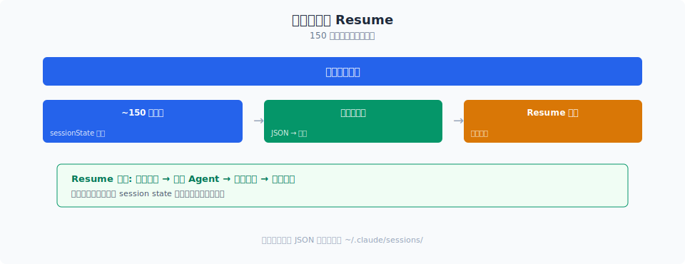
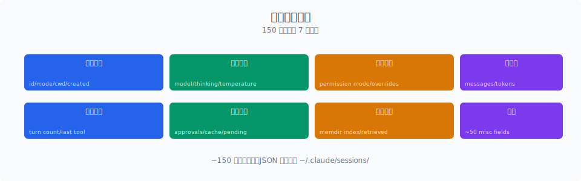

# 状态管理：Claude Code 如何用 150 个字段跟踪会话状态

> `bootstrap/state.ts` 有 1758 行，定义了约 150 个全局状态字段。这不是"代码臃肿"，而是生产级 Agent 的必需品——要支持数小时的长任务、断点续传、多模式切换，就必须跟踪足够多的状态。Claude Code 用 append-only 设计让状态可恢复、可审计、可回滚。

你好，我是江小湖。

上一章 [扩展机制](../11-extensibility/README.md) 讲到 Claude Code 如何通过 Hook/Skill/Plugin/MCP 扩展能力。但扩展越多，状态越复杂——一个装了 5 个 MCP Server、3 个 Plugin、10 个 Skill 的会话，状态如何管理？

Claude Code 的答案在 `bootstrap/state.ts` 里：一个 1758 行的状态定义文件，约 150 个字段。这个数字本身就说明了问题：**生产级 Agent 的状态管理，远比 demo 复杂。**

## 目录

- [为什么需要 150 个字段](#为什么需要-150-个字段)
- [状态的分层结构](#状态的分层结构)
- [Append-only 设计](#append-only-设计)
- [状态的序列化与持久化](#状态的序列化与持久化)
- [状态一致性检查](#状态一致性检查)
- [总结](#总结)
- [参考链接](#参考链接)

<p align="center">
  
  <br/>
  <em>150 个字段的持久化与 Resume 机制</em>
</p>


<p align="center">
  
  <br/>
  <em>Claude Code 源码解析 12-session-persistence 配图</em>
</p>
## 为什么需要 150 个字段

先看状态字段的分类：

| 分类 | 字段数 | 说明 |
|------|--------|------|
| **会话元信息** | ~15 | 会话 ID、开始时间、最后活跃时间、标题 |
| **Agent 配置** | ~20 | 运行模式、权限模式、模型设置、 effort 级别 |
| **上下文状态** | ~25 | 消息列表、压缩状态、token 预算、turn 计数 |
| **工具状态** | ~15 | 已注册工具、工具调用历史、并发限制 |
| **权限状态** | ~10 | 当前模式、用户确认记录、审计日志 |
| **扩展状态** | ~20 | 已加载 Skill、Plugin、MCP Server 状态 |
| **UI 状态** | ~15 | 渲染状态、焦点、滚动位置、主题 |
| **性能状态** | ~10 | 启动时间、调用延迟、token 消耗 |
| **网络状态** | ~10 | API 连接状态、重试计数、fallback 状态 |
| **其他** | ~10 | 缓存、临时变量、调试标志 |

**150 个字段不是随意堆砌的**，每个字段都有明确的用途。举几个例子：

```typescript
// bootstrap/state.ts 中的部分字段（简化版）
interface State {
  // 会话元信息
  sessionId: string;
  startedAt: number;
  lastActiveAt: number;
  sessionTitle: string | null;
  
  // Agent 配置
  permissionMode: PermissionMode;     // 当前权限模式
  effort: EffortLevel;               // 模型 effort 级别
  model: string;                     // 当前模型
  fastMode: boolean;                 // 是否 fast mode
  
  // 上下文状态
  messages: Message[];               // 对话历史
  contextBudget: ContextBudget;        // token 预算
  turnCount: number;                  // 当前 turn 数
  maxOutputTokensRecoveryCount: number; // 输出截断恢复计数
  autoCompactTracking: AutoCompactTrackingState | undefined; // 压缩跟踪
  
  // 工具状态
  tools: Tool[];                     // 已注册工具
  toolCallHistory: ToolCallRecord[]; // 工具调用历史
  concurrentToolLimit: number;      // 并发限制
  
  // 权限状态
  permissionLog: PermissionDecision[]; // 权限决策日志
  userConfirmationRate: number;       // 用户确认率（用于分类器）
  
  // 扩展状态
  loadedSkills: string[];            // 已加载 Skill
  loadedPlugins: string[];           // 已加载 Plugin
  mcpServers: MCPServerState[];      // MCP Server 状态
  
  // UI 状态
  currentView: ViewState;            // 当前视图
  scrollPosition: number;           // 滚动位置
  selectedSuggestion: number | null; // 选中的建议
  
  // 性能状态
  startupTime: number;              // 启动耗时
  totalTokensConsumed: number;      // 总 token 消耗
  apiCallLatency: number[];         // API 调用延迟历史
  
  // 网络状态
  apiConnectionStatus: 'connected' | 'disconnected' | 'degraded';
  retryCount: number;               // 当前重试计数
  fallbackModel: string | null;     // 降级模型
  
  // Sticky-on Latch（缓存保护）
  afkModeHeaderLatched: boolean | null;
  fastModeHeaderLatched: boolean | null;
  cacheEditingHeaderLatched: boolean | null;
  thinkingClearLatched: boolean | null;
}
```

**为什么这些字段不能合并或删除**：

1. **会话元信息**：需要记录会话的生命周期，用于超时检测、资源清理、成本统计。

2. **Agent 配置**：用户可能在会话中切换模式（如从 default 切换到 auto），必须记录当前配置。

3. **上下文状态**：token 预算、turn 计数、压缩状态等是实时变化的，需要精确跟踪。

4. **工具状态**：工具调用历史用于调试和审计，并发限制用于安全控制。

5. **权限状态**：权限决策日志是安全审计的关键证据，用户确认率用于 ML 分类器的上下文调整。

6. **扩展状态**：Skill/Plugin/MCP Server 的加载状态决定了哪些工具可用。

7. **UI 状态**：渲染状态、滚动位置等决定了用户看到的界面。

8. **性能状态**：启动时间、token 消耗等用于遥测和成本监控。

9. **网络状态**：API 连接状态、重试计数、降级模型等决定了 LLM 调用的策略。

10. **Sticky-on Latch**：缓存保护字段，一旦设置就不可重置，避免缓存失效。

## 状态的分层结构

150 个字段不是扁平的，而是分层的：

```typescript
// 状态分层结构（简化版）
interface State {
  // 第一层：不可变会话标识
  session: {
    id: string;
    createdAt: number;
  };
  
  // 第二层：用户配置（会话级，可修改）
  config: {
    permissionMode: PermissionMode;
    effort: EffortLevel;
    model: string;
    // ...
  };
  
  // 第三层：运行时状态（频繁变化）
  runtime: {
    messages: Message[];
    turnCount: number;
    contextBudget: ContextBudget;
    toolCallHistory: ToolCallRecord[];
    // ...
  };
  
  // 第四层：扩展状态（动态加载）
  extensions: {
    skills: SkillState[];
    plugins: PluginState[];
    mcpServers: MCPServerState[];
  };
  
  // 第五层：UI 状态（前端相关）
  ui: {
    currentView: ViewState;
    scrollPosition: number;
    // ...
  };
  
  // 第六层：性能与遥测（只增不减）
  telemetry: {
    startupTime: number;
    totalTokensConsumed: number;
    apiCallLatency: number[];
    // ...
  };
  
  // 第七层：缓存保护（Sticky-on）
  latches: {
    afkModeHeaderLatched: boolean | null;
    fastModeHeaderLatched: boolean | null;
    // ...
  };
}
```

**分层的设计逻辑**：

1. **不可变层**：会话 ID 和创建时间一旦确定，永远不变。这保证了会话的可追溯性。

2. **配置层**：用户配置在会话中可能修改，但修改频率低（如切换模式）。配置变更需要记录日志。

3. **运行时层**：最频繁变化的部分——每次对话、每次工具调用都会更新。这是状态管理的重点。

4. **扩展层**：动态加载的扩展状态。Skill/Plugin/MCP Server 的加载和卸载会改变这一层。

5. **UI 层**：与前端渲染相关的状态。这一层在 headless 模式（如 `-p`）下可以省略。

6. **遥测层**：只增不减的统计数据。用于成本监控、性能分析、用户行为分析。

7. **缓存保护层**：Sticky-on Latch，一旦设置就不可重置。这是性能优化的关键。

**分层的好处**：
- **序列化优化**：持久化时，不需要序列化所有层。比如 UI 层在恢复时不需要。
- **一致性检查**：不同层有不同的检查规则。不可变层不能修改，运行时层需要频繁验证。
- **权限隔离**：某些层（如遥测层）只有系统能写，用户不能修改。

## Append-only 设计

Claude Code 的状态管理有一个核心原则：**append-only**。这意味着：

```typescript
// Append-only 状态更新（简化版）
interface StateUpdate {
  timestamp: number;
  type: string;
  payload: unknown;
  previousState: string; // 前一状态的哈希
}

class AppendOnlyState {
  private updates: StateUpdate[] = [];
  private currentState: State;
  
  // 追加更新，不直接修改状态
  appendUpdate(update: Omit<StateUpdate, 'timestamp' | 'previousState'>): void {
    const stateUpdate: StateUpdate = {
      ...update,
      timestamp: Date.now(),
      previousState: this.hashState(this.currentState),
    };
    
    this.updates.push(stateUpdate);
    this.currentState = this.applyUpdate(this.currentState, update);
  }
  
  // 获取当前状态（应用所有更新后的结果）
  getState(): State {
    return this.currentState;
  }
  
  // 恢复到某个历史状态
  rewindTo(timestamp: number): State {
    let state = this.getInitialState();
    for (const update of this.updates) {
      if (update.timestamp > timestamp) break;
      state = this.applyUpdate(state, update);
    }
    return state;
  }
  
  // 导出完整历史（用于审计）
  exportHistory(): StateUpdate[] {
    return [...this.updates];
  }
}
```

**Append-only 的三个好处**：

1. **可恢复**：如果当前状态损坏，可以回滚到任意历史状态。只要从初始状态开始，逐个应用更新，就能重建任意时间点的状态。

2. **可审计**：完整的更新历史是审计日志。可以追溯"谁在什么时间做了什么操作"。

3. **可并行**：多个更新可以同时追加，不需要加锁。因为更新之间没有冲突（都是追加）。

**实际应用**：

```typescript
// 状态更新示例（简化版）
// 1. 用户发送消息
state.appendUpdate({
  type: 'user_message',
  payload: { role: 'user', content: '帮我重构这个函数' },
});

// 2. 模型生成响应
state.appendUpdate({
  type: 'assistant_message',
  payload: { role: 'assistant', content: '好的，我先看看代码...', tool_calls: [...] },
});

// 3. 工具调用
state.appendUpdate({
  type: 'tool_call',
  payload: { tool: 'read_file', args: { path: 'src/utils.ts' }, result: '...' },
});

// 4. 模式切换
state.appendUpdate({
  type: 'config_change',
  payload: { key: 'permissionMode', from: 'default', to: 'auto' },
});
```

每条更新记录包含：时间戳、类型、载荷、前一状态哈希。这形成了一个**状态链**，任何篡改都能被检测（因为哈希不匹配）。

## 状态的序列化与持久化

状态需要持久化到磁盘，支持断点续传。Claude Code 的序列化策略是**分层序列化**：

```typescript
// 分层序列化（简化版）
async function serializeState(state: State): Promise<SerializedState> {
  return {
    // 第一层：不可变标识（必须）
    session: state.session,
    
    // 第二层：配置（必须）
    config: state.config,
    
    // 第三层：运行时（必须，但压缩）
    runtime: {
      messages: compressMessages(state.runtime.messages), // 压缩消息
      turnCount: state.runtime.turnCount,
      contextBudget: state.runtime.contextBudget,
      // 不序列化 toolCallHistory（太详细，恢复时重建）
    },
    
    // 第四层：扩展（必须）
    extensions: {
      skills: state.extensions.skills.map(s => s.name),
      plugins: state.extensions.plugins.map(p => p.name),
      mcpServers: state.extensions.mcpServers.map(s => ({
        name: s.name,
        connected: s.connected,
      })),
    },
    
    // 第五层：UI（可选，headless 模式跳过）
    ui: state.ui,
    
    // 第六层：遥测（只序列化摘要）
    telemetry: {
      totalTokensConsumed: state.telemetry.totalTokensConsumed,
      startupTime: state.telemetry.startupTime,
    },
    
    // 第七层：缓存保护（必须）
    latches: state.latches,
  };
}
```

**序列化策略**：

| 层 | 策略 | 原因 |
|----|------|------|
| 不可变标识 | 完整序列化 | 必须保留 |
| 配置 | 完整序列化 | 必须保留 |
| 运行时 | 压缩序列化 | 消息需要压缩，工具历史可重建 |
| 扩展 | 摘要序列化 | 只需名称和状态，详细配置恢复时重新加载 |
| UI | 可选序列化 | headless 模式不需要 |
| 遥测 | 摘要序列化 | 完整历史太大，只保留摘要 |
| 缓存保护 | 完整序列化 | 必须保留 |

**持久化格式**：序列化后的状态以 JSON 格式存储：

```json
{
  "session": {
    "id": "abc123",
    "createdAt": 1718765432100
  },
  "config": {
    "permissionMode": "auto",
    "effort": "high",
    "model": "claude-sonnet-4"
  },
  "runtime": {
    "messages": ["compressed:..."],
    "turnCount": 42,
    "contextBudget": { "used": 150000, "total": 200000 }
  },
  "extensions": {
    "skills": ["react-component", "code-review"],
    "plugins": [],
    "mcpServers": [
      { "name": "filesystem", "connected": true },
      { "name": "github", "connected": false }
    ]
  },
  "latches": {
    "afkModeHeaderLatched": true,
    "fastModeHeaderLatched": null
  }
}
```

**存储位置**：
- **主存储**：`~/.claude/sessions/{sessionId}.json`
- **备份存储**：`~/.claude/sessions/backup/{sessionId}-{timestamp}.json`
- **临时存储**：`/tmp/claude-sessions/{sessionId}.json`（用于崩溃恢复）

## 状态一致性检查

状态恢复时，需要验证一致性。Claude Code 有三层检查：

```typescript
// 状态一致性检查（简化版）
async function validateState(state: SerializedState): Promise<ValidationResult> {
  const errors: string[] = [];
  
  // 1. 结构检查：所有必填字段是否存在
  if (!state.session?.id) errors.push('Missing session.id');
  if (!state.config?.permissionMode) errors.push('Missing config.permissionMode');
  if (!state.runtime?.messages) errors.push('Missing runtime.messages');
  
  // 2. 类型检查：字段类型是否正确
  if (typeof state.runtime.turnCount !== 'number') {
    errors.push('Invalid turnCount type');
  }
  if (!Array.isArray(state.runtime.messages)) {
    errors.push('Invalid messages type');
  }
  
  // 3. 逻辑检查：字段之间的一致性
  if (state.runtime.turnCount !== state.runtime.messages.length) {
    errors.push('turnCount does not match messages.length');
  }
  if (state.runtime.contextBudget.used > state.runtime.contextBudget.total) {
    errors.push('Context budget exceeded');
  }
  
  // 4. 哈希检查：验证状态是否被篡改
  const expectedHash = calculateStateHash(state);
  if (state.hash && state.hash !== expectedHash) {
    errors.push('State hash mismatch (possible tampering)');
  }
  
  // 5. 扩展检查：已加载的扩展是否仍然可用
  for (const skill of state.extensions.skills) {
    if (!await isSkillAvailable(skill)) {
      errors.push(`Skill ${skill} is no longer available`);
    }
  }
  
  return {
    valid: errors.length === 0,
    errors,
  };
}
```

**一致性检查的五层**：

1. **结构检查**：所有必填字段是否存在。如果缺失，说明序列化不完整或版本不兼容。

2. **类型检查**：字段类型是否正确。比如 `turnCount` 必须是数字，`messages` 必须是数组。

3. **逻辑检查**：字段之间的一致性。比如 `turnCount` 应该等于 `messages.length`（如果不对等，说明状态已损坏）。

4. **哈希检查**：验证状态是否被篡改。如果哈希不匹配，说明文件被外部修改。

5. **扩展检查**：已加载的扩展是否仍然可用。如果某个 Skill 被删除，恢复时需要提示用户。

**修复策略**：如果一致性检查失败，Claude Code 的修复策略是：

| 错误类型 | 修复策略 |
|----------|----------|
| 缺失字段 | 使用默认值填充，记录警告 |
| 类型错误 | 尝试转换，转换失败则使用默认值 |
| 逻辑不一致 | 以 messages 为准，重新计算 turnCount |
| 哈希不匹配 | 拒绝恢复，提示用户状态可能损坏 |
| 扩展不可用 | 跳过该扩展，记录警告 |

## 总结

- `bootstrap/state.ts` 的 1758 行定义了约 **150 个状态字段**，覆盖会话元信息、配置、运行时、扩展、UI、遥测、缓存保护七个维度。
- **七层状态结构**让状态管理清晰：不可变层 → 配置层 → 运行时层 → 扩展层 → UI 层 → 遥测层 → 缓存保护层。
- **Append-only 设计**让状态可恢复（回滚到任意历史点）、可审计（完整更新历史）、可并行（无锁追加）。
- **分层序列化**根据重要性选择策略：必须层完整序列化、运行时层压缩序列化、遥测层摘要序列化、UI 层可选序列化。
- **五层一致性检查**（结构、类型、逻辑、哈希、扩展）确保恢复后的状态可用，修复策略覆盖常见损坏场景。

> 下一篇：[Resume 机制](./02-resume.md)，看 Claude Code 如何利用 append-only 状态实现断点续传。

## 参考链接

- [Claude Code 状态管理源码](file:///E:/Projects/claude-code/src/bootstrap/state.ts)
- [Claude Code 状态持久化源码](file:///E:/Projects/claude-code/src/utils/sessionStorage.ts)
- [Anthropic Claude Code 官方文档](https://docs.anthropic.com/en/docs/claude-code/overview)
