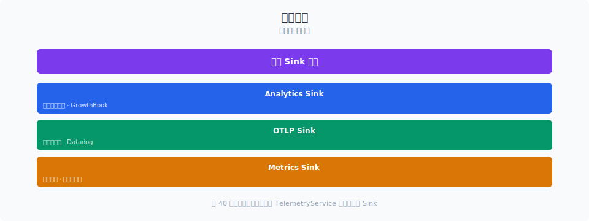
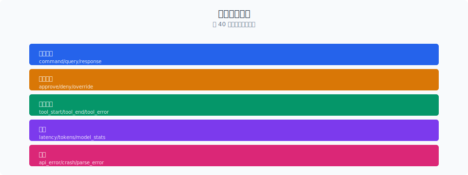

# 三层 Sink：事件分发的架构

> Claude Code 的可观测性不是事后补丁，而是设计时就内建的。所有事件经过统一的 Sink 接口分发到 Datadog（外部监控）和 1P Event Logging（内部数据分析），第三层 Diagnostic Tracking 负责实时代码诊断。三层各司其职，互不干扰。

你好，我是江小湖。

上一章 [会话持久化](../12-session-persistence/README.md) 讲到 Claude Code 如何用 append-only 状态管理支持断点续传。状态持久化解决的是"恢复"问题，但恢复后怎么知道系统是否健康？哪些操作成功了？哪些失败了？这就要靠可观测性。

Claude Code 的可观测性架构藏在一个不起眼的目录里：`src/services/analytics/`。整个 analytics 模块只有 7 个文件，却支撑了 1884 个 TS 文件中 171 处 `logEvent` 调用。它用三层 Sink 设计做到了：**统一入口、分级路由、互不阻塞。**

## 目录

- [Sink 接口与事件队列](#sink-接口与事件队列)
- [第一层：Datadog 外部监控](#第一层datadog-外部监控)
- [第二层：1P Event Logging](#第二层1p-event-logging)
- [第三层：Diagnostic Tracking](#第三层diagnostic-tracking)
- [三层协作：一次事件的完整旅程](#三层协作一次事件的完整旅程)
- [Killswitch：远程关闭 Sink](#killswitch远程关闭-sink)
- [总结](#总结)
- [参考链接](#参考链接)

<p align="center">
  
  <br/>
  <em>事件的分层分发：Analytics/OTLP/Metrics</em>
</p>


<p align="center">
  
  <br/>
  <em>Claude Code 源码解析 13-telemetry 配图</em>
</p>
## Sink 接口与事件队列

整个 analytics 模块的入口是 `index.ts`，它定义了一个极简的 Sink 接口：

```typescript
// services/analytics/index.ts

// Sink 接口——所有 analytics 后端必须实现这两个方法
export type AnalyticsSink = {
  logEvent: (eventName: string, metadata: LogEventMetadata) => void
  logEventAsync: (
    eventName: string,
    metadata: LogEventMetadata,
  ) => Promise<void>
}

// 全局唯一的 sink 实例
let sink: AnalyticsSink | null = null

// sink 未初始化前的事件队列
const eventQueue: QueuedEvent[] = []
```

**设计要点**：`index.ts` 没有任何依赖（注释明确写了"NO dependencies to avoid import cycles"）。它只提供 `logEvent()` 和 `logEventAsync()` 两个公共 API，其余 1884 个文件都通过这两个函数上报事件。

**事件队列**解决了一个冷启动问题：Claude Code 启动过程中（读取配置、初始化 MCP、加载 Skill）可能在 sink 初始化之前就产生事件。这些事件不会丢失，而是进入队列，等 sink 挂载后异步排空：

```typescript
// services/analytics/index.ts

export function attachAnalyticsSink(newSink: AnalyticsSink): void {
  if (sink !== null) return  // 幂等：重复调用是 no-op
  sink = newSink

  // 异步排空队列，避免阻塞启动
  if (eventQueue.length > 0) {
    const queuedEvents = [...eventQueue]
    eventQueue.length = 0

    // ant（Anthropic 员工）可以看到队列大小，帮助调试初始化时序
    if (process.env.USER_TYPE === 'ant') {
      sink.logEvent('analytics_sink_attached', {
        queued_event_count: queuedEvents.length,
      })
    }

    queueMicrotask(() => {
      for (const event of queuedEvents) {
        if (event.async) {
          void sink!.logEventAsync(event.eventName, event.metadata)
        } else {
          sink!.logEvent(event.eventName, event.metadata)
        }
      }
    })
  }
}
```

**幂等设计**让 `attachAnalyticsSink` 可以从多个启动路径安全调用（preAction hook 和 setup() 都会调用），不需要协调——第一个调用者生效，后续都是 no-op。

## 第一层：Datadog 外部监控

Datadog 是 Claude Code 的外部监控后端，负责实时告警和仪表盘展示。

```typescript
// services/analytics/datadog.ts

const DATADOG_LOGS_ENDPOINT =
  'https://http-intake.logs.us5.datadoghq.com/api/v2/logs'
const DATADOG_CLIENT_TOKEN = 'pubbbf48e6d78dae54bceaa4acf463299bf'
const DEFAULT_FLUSH_INTERVAL_MS = 15000  // 15 秒批量刷新
const MAX_BATCH_SIZE = 100               // 满 100 条立即刷新
```

Datadog 有**三个门控条件**，全部通过才会发送：

```typescript
export async function trackDatadogEvent(
  eventName: string,
  properties: { [key: string]: boolean | number | undefined },
): Promise<void> {
  // 门控 1：只在生产环境发送
  if (process.env.NODE_ENV !== 'production') return

  // 门控 2：第三方 Provider（Bedrock/Vertex/Foundry）不发送
  if (getAPIProvider() !== 'firstParty') return

  // 门控 3：事件名必须在白名单内
  if (!DATADOG_ALLOWED_EVENTS.has(eventName)) return
  // ...
}
```

**事件白名单**是关键设计——不是所有事件都能发到 Datadog。白名单目前约 40 个事件，全部以 `tengu_`（Claude Code 的内部代号）或 `chrome_bridge_` 开头：

```typescript
const DATADOG_ALLOWED_EVENTS = new Set([
  'tengu_init',                    // 初始化
  'tengu_started',                 // 启动完成
  'tengu_cancel',                  // 用户取消
  'tengu_exit',                    // 退出
  'tengu_api_error',               // API 错误
  'tengu_api_success',             // API 成功
  'tengu_tool_use_success',        // 工具调用成功
  'tengu_tool_use_error',          // 工具调用失败
  'tengu_compact_failed',          // 上下文压缩失败
  'tengu_model_fallback_triggered',// 模型降级触发
  'tengu_uncaught_exception',      // 未捕获异常
  'tengu_unhandled_rejection',     // 未处理的 Promise 拒绝
  'tengu_oauth_error',             // OAuth 错误
  // ... 约 40 个
])
```

**批量发送**减少网络请求：事件先进入内存队列 `logBatch`，满 100 条或 15 秒后批量发送。发送失败只记错误日志，不重试（Datadog 是 best-effort 通道）。

**基数控制**是 Datadog 发送的核心优化。高基数字段（如用户 ID、完整模型名）如果不控制，会导致 Datadog 标签爆炸，查询变慢、成本飙升。Claude Code 用三种策略控制基数：

```typescript
// 策略 1：MCP 工具名归一化
if (allData.toolName?.startsWith('mcp__')) {
  allData.toolName = 'mcp'  // mcp__slack__read_channel → mcp
}

// 策略 2：模型名缩短（非 ant 用户）
if (process.env.USER_TYPE !== 'ant' && typeof allData.model === 'string') {
  const shortName = getCanonicalName(allData.model.replace(/\[1m]$/i, ''))
  allData.model = shortName in MODEL_COSTS ? shortName : 'other'
}

// 策略 3：用户 ID 分桶（30 个桶）
const getUserBucket = memoize((): number => {
  const userId = getOrCreateUserID()
  const hash = createHash('sha256').update(userId).digest('hex')
  return parseInt(hash.slice(0, 8), 16) % NUM_USER_BUCKETS
})
```

用户 ID 分桶是一个精妙设计：把用户 ID 的 SHA256 哈希对 30 取模，得到 0-29 的桶号。统计"受影响用户数"时只需 `count distinct(bucket)`，既保护隐私又控制基数。

## 第二层：1P Event Logging

1P（First Party）是 Anthropic 内部的数据分析通道，数据最终进入 BigQuery 供产品分析使用。

```typescript
// services/analytics/firstPartyEventLogger.ts

export function logEventTo1P(
  eventName: string,
  metadata: Record<string, number | boolean | undefined> = {},
): void {
  if (!is1PEventLoggingEnabled()) return
  if (!firstPartyEventLogger || isSinkKilled('firstParty')) return

  // Fire and forget——不阻塞调用方
  void logEventTo1PAsync(firstPartyEventLogger, eventName, metadata)
}
```

1P 和 Datadog 有本质区别：**Datadog 是 fire-and-forget，1P 是 disk-backed retry。**

```typescript
// services/analytics/firstPartyEventLoggingExporter.ts

export class FirstPartyEventLoggingExporter implements LogRecordExporter {
  // 失败事件写入磁盘，下次启动时重试
  private readonly maxAttempts: number  // 最大重试次数
  // 批量配置从 GrowthBook 动态获取
  // 端点：/api/event_logging/batch
}
```

1P 基于 OpenTelemetry SDK 构建，但**独立于客户的 OTLP 遥测**。源码注释明确说明这一点：

> We don't register this globally - it's only used for internal event logging.

这意味着：客户如果配置了自己的 OTLP endpoint，内部事件不会泄露到客户端点，反之亦然。

**Proto Schema 强约束**：1P 事件使用 Protocol Buffer 生成的类型定义。`metadata.ts` 中的 `to1PEventFormat()` 函数把 camelCase 字段转换为 snake_case，并严格匹配 proto 定义。注释记录了血泪教训：

> The generated toJSON() serializer silently drops unknown keys — a hand-written parallel type previously let #11318, #13924, #19448, and coworker_type all ship fields that never reached BQ.

也就是说，曾经因为手写类型而不是用 proto 生成，导致 4 个字段（包括 coworker_type）永远没到达 BigQuery。这是一个**"类型安全≠数据安全"**的教训。

**采样控制**：1P 支持按事件名配置采样率，通过 GrowthBook 动态配置：

```typescript
// services/analytics/firstPartyEventLogger.ts

export function shouldSampleEvent(eventName: string): number | null {
  const config = getEventSamplingConfig()
  const eventConfig = config[eventName]

  if (!eventConfig) return null  // 无配置 = 100% 采样

  const sampleRate = eventConfig.sample_rate
  if (sampleRate <= 0) return 0      // 0 = 完全丢弃
  if (sampleRate >= 1) return null    // 1 = 100% 采样
  return Math.random() < sampleRate ? sampleRate : 0
}
```

被采样的事件会附带 `sample_rate` 字段，BigQuery 查询时可以用它反推真实数量。

## 第三层：Diagnostic Tracking

第三层不是传统的"日志上报"，而是**实时代码诊断追踪**。它通过 IDE MCP 连接获取 LSP 诊断信息（编译错误、类型错误、lint 警告）。

```typescript
// services/diagnosticTracking.ts

export class DiagnosticTrackingService {
  private baseline: Map<string, Diagnostic[]> = new Map()

  // 编辑文件前，先记录当前诊断作为基线
  async beforeFileEdited(filePath: string): Promise<void> {
    const result = await callIdeRpc('getDiagnostics', { uri: `file://${filePath}` })
    this.baseline.set(filePath, result.diagnostics)
  }

  // 编辑后，获取新诊断（减去基线 = Claude 引入的错误）
  async getNewDiagnostics(): Promise<DiagnosticFile[]> {
    // 只返回 baseline 中不存在的诊断
    // 即 Claude Code 自己引入的错误
  }
}
```

**核心逻辑**：编辑前快照 → 编辑后对比 → 只反馈新增的诊断。这让 Claude Code 能知道"我改了代码后引入了什么错误"，而不被已有错误干扰。

诊断追踪是**单例模式**，只在有 IDE 连接时工作。它支持 `file://` 和 `_claude_fs_right:` 两种 URI 协议，通过 `normalizePathForComparison` 处理 Windows 路径大小写问题。

## 三层协作：一次事件的完整旅程

当 Claude Code 执行一次工具调用时，三层 Sink 各自发挥作用：

```typescript
// sink.ts 中的分发逻辑

function logEventImpl(eventName: string, metadata: LogEventMetadata): void {
  // 1. 采样检查
  const sampleResult = shouldSampleEvent(eventName)
  if (sampleResult === 0) return  // 被采样丢弃

  // 2. Datadog：剥离 PII 后发送
  if (shouldTrackDatadog()) {
    void trackDatadogEvent(eventName, stripProtoFields(metadataWithSampleRate))
  }

  // 3. 1P：完整发送（含 _PROTO_* 字段）
  logEventTo1P(eventName, metadataWithSampleRate)
}
```

| 层 | 角色 | 可靠性 | 延迟 | 数据完整性 |
|----|------|--------|------|-----------|
| Datadog | 外部监控告警 | Best-effort | 15s 批量 | 白名单事件 + PII 剥离 |
| 1P | 内部分析 | 磁盘重试 | 10s 批量 | 全部事件 + Proto schema |
| Diagnostic | 代码诊断 | 实时 | 即时 | 仅 IDE 连接时 |

**关键设计：`stripProtoFields`**。1P 接收的完整 payload 中可能包含 `_PROTO_*` 前缀的字段（标记为 PII-tagged，允许包含未脱敏的用户数据）。Datadog 是通用访问后端，不能看到这些字段。`stripProtoFields` 在 Datadog 发送前剥离所有 `_PROTO_*` 键——一处过滤，保护所有非 1P 通道。

```typescript
// services/analytics/index.ts

export function stripProtoFields<V>(
  metadata: Record<string, V>,
): Record<string, V> {
  let result: Record<string, V> | undefined
  for (const key in metadata) {
    if (key.startsWith('_PROTO_')) {
      if (result === undefined) {
        result = { ...metadata }
      }
      delete result[key]
    }
  }
  return result ?? metadata
}
```

## Killswitch：远程关闭 Sink

每层 Sink 都可以独立关闭，通过 GrowthBook 的 killswitch 配置实现：

```typescript
// services/analytics/sinkKillswitch.ts

const SINK_KILLSWITCH_CONFIG_NAME = 'tengu_frond_boric'  // 混淆名

export function isSinkKilled(sink: SinkName): boolean {
  const config = getDynamicConfig_CACHED_MAY_BE_STALE<
    Partial<Record<SinkName, boolean>>
  >(SINK_KILLSWITCH_CONFIG_NAME, {})
  return config?.[sink] === true  // fail-open：配置缺失 = 不关闭
}
```

**Fail-open 设计**：配置缺失或格式错误时，sink 保持开启。宁可多收数据也不丢数据。配置名 `tengu_frond_boric` 是混淆后的名称，不是可读的 `sink_killswitch`——这是一种轻量的反探测措施。

Killswitch 在 `sink.ts` 和 `firstPartyEventLogger.ts` 中被检查：

```typescript
// Datadog 层
function shouldTrackDatadog(): boolean {
  if (isSinkKilled('datadog')) return false  // 远程关闭
  // ...
}

// 1P 层
export function logEventTo1P(eventName: string, metadata: ...): void {
  if (!firstPartyEventLogger || isSinkKilled('firstParty')) return  // 远程关闭
  // ...
}
```

**全局禁用**：除了 per-sink killswitch，还有全局开关。`config.ts` 中的 `isAnalyticsDisabled()` 在以下情况关闭所有 analytics：

```typescript
// services/analytics/config.ts

export function isAnalyticsDisabled(): boolean {
  return (
    process.env.NODE_ENV === 'test' ||                          // 测试环境
    isEnvTruthy(process.env.CLAUDE_CODE_USE_BEDROCK) ||         // Bedrock
    isEnvTruthy(process.env.CLAUDE_CODE_USE_VERTEX) ||          // Vertex
    isEnvTruthy(process.env.CLAUDE_CODE_USE_FOUNDRY) ||         // Foundry
    isTelemetryDisabled()                                       // 用户隐私设置
  )
}
```

## 总结

- Claude Code 的可观测性采用**三层 Sink 架构**：Datadog（外部监控）、1P Event Logging（内部分析）、Diagnostic Tracking（代码诊断），各层独立运作、互不阻塞。
- **统一入口** `logEvent()` 通过事件队列 + 幂等挂载解决冷启动问题，171 处调用点不需要关心后端实现。
- **Datadog** 是 best-effort 通道：白名单事件、15 秒批量、基数控制（工具名归一化、模型名缩短、用户 ID 分桶）。
- **1P** 是可靠通道：基于 OpenTelemetry SDK 但独立于客户遥测、Proto Schema 强约束、磁盘重试、GrowthBook 动态采样。
- **Diagnostic Tracking** 是实时通道：通过 IDE MCP 获取 LSP 诊断，"编辑前快照 → 编辑后对比"过滤出 Claude 引入的新错误。
- **Killswitch** 支持远程关闭单个 sink，fail-open 设计确保配置异常时数据不丢。

> 下一篇：[类型级数据治理](./02-type-governance.md)，看 `AnalyticsMetadata_I_VERIFIED_THIS_IS_NOT_CODE_OR_FILEPATHS` 这个超长类型名背后的 PII 防御设计。

## 参考链接

- [Claude Code Analytics 源码](file:///E:/Projects/external/claude-code/src/services/analytics/)
- [OpenTelemetry Logs SDK](https://opentelemetry.io/docs/specs/otel/logs/)
- [Datadog Logs API](https://docs.datadoghq.com/api/latest/logs/)
- [GrowthBook Dynamic Config](https://docs.growthbook.io/lib/js#dynamic-config)
