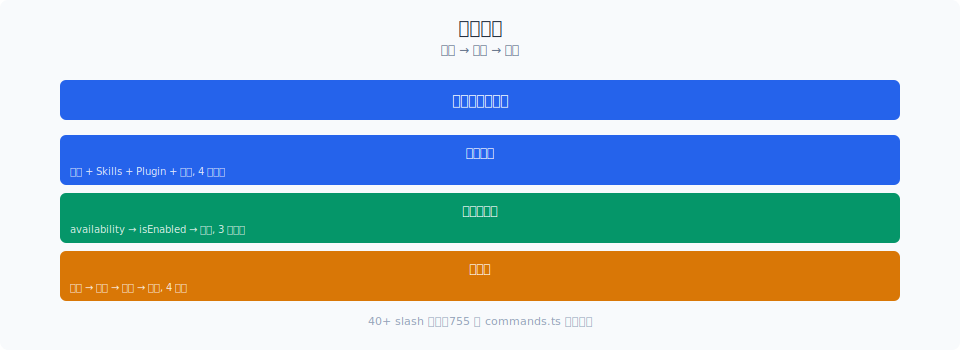

# 命令生命周期：解析、排队、执行、中断

> `handlePromptSubmit.ts` 有 612 行，但它管理的不是一条命令——而是一个从用户按键到 Agent 响应的完整状态机。Slash 命令的生命周期被拆成四个阶段：解析 → 排队 → 执行 → 清理，每个阶段都有精心设计的并发控制和中断处理。

你好，我是江小湖。

[上一篇文章](./01-registration.md) 讲了命令如何注册和分发。本篇聚焦在命令的执行阶段——从用户按下回车到 Agent 执行完毕，中间发生了什么。

## 目录

- [四阶段状态机](#四阶段状态机)
- [解析：从字符串到 QueuedCommand](#解析从字符串到-queuedcommand)
- [排队：messageQueueManager 的事件总线](#排队messagequeuemanager-的事件总线)
- [执行：三种类型的三种路径](#执行三种类型的三种路径)
- [中断：优雅地停止](#中断优雅地停止)
- [Bridge Safe：远程命令的防火墙](#bridge-safe远程命令的防火墙)
- [总结](#总结)
- [参考链接](#参考链接)

<p align="center">
  
  <br/>
  <em>40+ slash 命令的注册与过滤</em>
</p>


<p align="center">
  
  <br/>
  <em>Claude Code 源码解析 15-cli-commands 配图</em>
</p>
## 四阶段状态机

`handlePromptSubmit.ts` 实现了一个清晰的四阶段状态机：

```text
用户输入 → 解析 → 排队 → 执行 → 清理
              ↓       ↓       ↓       ↓
           slash?   当前轮?  prompt?  DONE回调
           exit?    中断?   local?   清理JSX
           trim?    跳过?   jsx?    释放Guard
```

每个阶段有各自的守卫条件：

| 阶段 | 关键判断 | 分流逻辑 |
|------|---------|---------|
| 解析 | 是否为 slash 命令？| `/` + 空格 → 提取 commandName + args |
| 排队 | queryGuard 是否 active？| active → 入队；idle → 直接执行 |
| 执行 | 命令类型是什么？| prompt → 生成提示词；local → call()；jsx → load() + call() |
| 清理 | onDone 是否已调用？| 清理 JSX、reset Guard、更新 Input |

## 解析：从字符串到 QueuedCommand

### 入口：handlePromptSubmit

```typescript
export async function handlePromptSubmit(
  params: HandlePromptSubmitParams,
): Promise<void> {
  const input = params.input ?? ''
  const mode = params.mode ?? 'prompt'

  if (input.trim() === '') return  // 空输入直接丢弃

  // 特殊处理 exit/quit/:q 退格命令
  if (!skipSlashCommands &&
      ['exit', 'quit', ':q', ':q!', ':wq', ':wq!'].includes(input.trim())) {
    // 递归提交 /exit 命令
    void handlePromptSubmit({ ...params, input: '/exit' })
    return
  }
  // ...
}
```

**Vim 退格命令被映射到 `/exit`**——`:q`、`:wq`、`:wq!` 都会触发退出流程，而不是做一个简单的 `process.exit()`。这确保了退出前触发反馈对话框（feedback dialog）。

### Slash 命令解析 vs 普通文本

解析的核心判断在 230 行附近：

```typescript
if (!skipSlashCommands && finalInput.trim().startsWith('/')) {
  const trimmedInput = finalInput.trim()
  const spaceIndex = trimmedInput.indexOf(' ')
  const commandName = spaceIndex === -1
    ? trimmedInput.slice(1)
    : trimmedInput.slice(1, spaceIndex)
  const commandArgs = spaceIndex === -1
    ? '' : trimmedInput.slice(spaceIndex + 1).trim()

  // 查找 immediate 命令
  const immediateCommand = commands.find(
    cmd => cmd.immediate && isCommandEnabled(cmd) &&
      (cmd.name === commandName || cmd.aliases?.includes(commandName) ||
       getCommandName(cmd) === commandName),
  )
```

两种分流：
1. **`immediate` 命令**（local-jsx 类型 + queryGuard 活跃）→ 立即执行，绕过队列
2. **普通命令**（prompt 类型或 local 类型）→ 排队

`immediate` 的设计是为了 `/config`、`/theme` 这样的 UI 命令——即使在模型正在生成（queryGuard isActive）时也要立即响应。用户不会等待模型生成完再调 UI。

### QueuedCommand 结构

```typescript
type QueuedCommand = {
  value: string           // 展开引用后的最终文本
  preExpansionValue: string  // 原始文本（粘贴引用前）
  mode: PromptInputMode   // 'prompt' | 'bash' | ...
  pastedContents?: Record<number, PastedContent>  // 粘贴的图片
  skipSlashCommands?: boolean  // 远程 bridge 消息跳过
  uuid?: UUID             // 用于关联请求
}
```

注意 `preExpansionValue` 和 `value` 的分离：如果用户粘贴了 `[Image #1]` 引用，`value` 是展开后的（可能包含 base64），`preExpansionValue` 保持原始引用形式——用于保留历史记录的简洁性。

## 排队：messageQueueManager 的事件总线

当 Agent 正在执行（queryGuard.isActive = true），新命令不能直接执行——会被 `enqueue()` 函数放入消息队列：

```typescript
if (queryGuard.isActive || isExternalLoading) {
  if (mode !== 'prompt' && mode !== 'bash') return  // 只排队 prompt/bash

  // 可中断工具的响应：cancel 当前 turn
  if (params.hasInterruptibleToolInProgress) {
    params.abortController?.abort('interrupt')
  }

  enqueue({
    value: finalInput.trim(),
    preExpansionValue: input.trim(),
    mode,
    pastedContents: hasImages ? pastedContents : undefined,
    skipSlashCommands,
    uuid,
  })

  // 清除输入缓冲区
  onInputChange('')
  setCursorOffset(0)
  setPastedContents({})
  resetHistory()
  clearBuffer()
  return
}
```

关键逻辑：
1. **只接受 prompt 和 bash 模式**——其他模式的消息（如语音）不排队
2. **中断可中断工具**——如果 `hasInterruptibleToolInProgress` 为 true（如 SleepTool 运行时），立即 abort 当前 turn
3. **立即清屏**——输入被确认入队后，清空输入框、重置历史，让用户可以继续打字

`messageQueueManager` 自己维护一个 FIFO 队列。当 Agent 完成当前 turn 后，排队消息被 `executeUserInput` 处理。

## 执行：三种类型的三种路径

命令执行的核心在 `executeUserInput`（private 函数），对三种命令类型走不同的路径：

### 路径 1：prompt 命令（如 /commit）

```typescript
// processSlashCommand.tsx (simplified)
async function processSlashCommand(
  commandName: string,
  commandArgs: string,
  command: PromptCommand,
  context: ProcessUserInputContext,
): Promise<void> {
  // 1. 调用 getPromptForCommand 生成提示词
  const messages = await command.getPromptForCommand(commandArgs, context)

  // 2. 把提示词作为用户消息注入
  context.setMessages(prev => [...prev, ...messages])

  // 3. 触发 Agent 执行
  await context.onQuery(...)
}
```

核心机制：**prompt 命令的本质是把命令转换为一段提示词**。`/commit` 生成的提示词包含 `git status`、`git diff HEAD` 的输出和 commit 指令。Agent 不"执行"`/commit`——它执行的是转换后的提示词。

### 路径 2：local 命令（如 /cost）

```typescript
const commandModule = await command.load()
const result = await commandModule.call(args, context)

// 四种可能的结果类型
switch (result.type) {
  case 'text':      // 显示文本
  case 'compact':   // 触发上下文压缩
  case 'skip':       // 跳过消息
}
```

local 命令直接操作 AppState——不经过 LLM 调用。它们纯粹是工程逻辑。

### 路径 3：local-jsx 命令（如 /init、/config）

```typescript
const impl = await immediateCommand.load()
const jsx = await impl.call(onDone, context, commandArgs)

if (jsx && !doneWasCalled) {
  setToolJSX({
    jsx,
    shouldHidePromptInput: false,
    isLocalJSXCommand: true,
    isImmediate: true,
  })
}
```

local-jsx 命令返回 React 组件（Ink 渲染），用 `setToolJSX` 替换终端界面。同时传入 `onDone` 回调，命令完成时调用 `onDone(result, options)` 清理 JSX 并恢复终端。

### Guard 机制

所有路径共享一个 Guard 保护：

```typescript
try {
  queryGuard.reserve()  // 防止并发执行
  // ... 执行命令
} finally {
  queryGuard.cancelReservation()  // 释放 Guard
}
```

`queryGuard.reserve()` 确保一次只有一个 `executeUserInput` 在运行。嵌套的 `handlePromptSubmit` 调用会被 `queryGuard.isActive` 检查拦截并排队。

## 中断：优雅地停止

Claude Code 有两个层面的中断：

### 层面 1：工具级中断

```typescript
if (params.hasInterruptibleToolInProgress) {
  params.abortController?.abort('interrupt')
}
```

`hasInterruptibleToolInProgress` 表示所有执行中的工具都有 `interruptBehavior = 'cancel'`（如 SleepTool）。这种场景下，用户的新输入直接 abort 当前 turn。

`AbortReason = 'interrupt'` 会被 `processUserInput` 的 catch 块捕获，Agent 停止生成，转而处理用户的新消息。

### 层面 2：Bridge Safe 的层面

并非所有命令都能从手机端（Remote Control Bridge）安全执行。`BRIDGE_SAFE_COMMANDS` 定义了安全名单：

```typescript
export const BRIDGE_SAFE_COMMANDS: Set<Command> = new Set([
  compact,      // 压缩上下文 — 手机端有用
  clear,        // 清屏
  cost,         // 查看成本
  summary,      // 摘要对话
  releaseNotes, // 更新日志
  files,        // 文件列表
].filter((c): c is Command => c !== null))
```

三类命令在 Bridge 中的安全性：

| 类型 | Bridge 安全 | 原因 |
|------|-----------|------|
| prompt | ✅ 默认安全 | 只生成提示词文本，无本地副作用 |
| local + BRIDGE_SAFE | ✅ 白名单允许 | 纯文本输出，无终端独占效果 |
| local-jsx | ❌ 默认阻止 | Ink UI 渲染需要本地终端 |

## Bridge Safe：远程命令的防火墙

除了 `BRIDGE_SAFE_COMMANDS`，还有 `REMOTE_SAFE_COMMANDS` 用于远程模式：

```typescript
export function isBridgeSafeCommand(cmd: Command): boolean {
  if (cmd.type === 'local-jsx') return false  // Ink UI 渲染 → 禁止
  if (cmd.type === 'prompt') return true      // 文本输出 → 安全
  return BRIDGE_SAFE_COMMANDS.has(cmd)         // local 类型 → 白名单检查
}
```

**设计原理**：PR #19134 记录了早期的一个 bug——`/model` 从 iOS 端执行时，弹出了本地的 Ink 模型选择器（导致 crash）。修复方案就是两个层次的安全检查：先按类型分类（prompt 安全、local-jsx 不安全），再对 local 类型做 explicit allowlist。

`skipSlashCommands` 参数为远程消息提供了另一层防御：

```typescript
// Skip for remote bridge messages — "exit" typed on iOS shouldn't kill
// the local session
if (!skipSlashCommands && ['exit', 'quit', ...].includes(input.trim())) {
```

远程客户端发的 `exit` 不会杀死本地 session。`skipSlashCommands` 把所有以 `/` 开头的输入视为普通文本。

## 总结

命令生命周期设计的几个关键洞察：

1. **Guard 锁**——`queryGuard.reserve()` 防止并发 `executeUserInput`，确保排队和执行的正确性
2. **Immediate 命令**——绕过队列直接执行，用 `setToolJSX` 渲染 UI 而非排队等待
3. **Prompt 命令 = 提示词转换**——`/commit`、`/doctor`、`/init` 本质上把命令 args 转换为一段 LLM 提示词
4. **中断=协作**——不是暴力 kill，而是用 `AbortReason = 'interrupt'` 通知 Agent 停止当前任务，转而处理新消息
5. **Bridge Safe 的默认拒绝策略**——不是"允许已知安全"，而是"禁止已知不安全"——remote/local 默认阻止，prompt 默认允许，local 需要 explicit allowlist

这些设计让 Claude Code 的 CLI 在"响应式 UI"和"安全的 Agent 执行"之间找到了好的平衡。

> 学完本章后，请继续阅读 [16 — 终端 UI 框架](../16-terminal-ui/README.md)，看 React + Ink 如何渲染所有这些命令的界面。

## 参考链接

- `src/utils/handlePromptSubmit.ts` — 命令执行的主流程（612 行）
- `src/types/command.ts` — Command 类型定义（LocalJSXCommand、PromptCommand 等）
- `src/commands.ts` — 命令注册和查找函数（755 行）
- `src/utils/messageQueueManager.ts` — 消息排队和分发（17KB）
- `src/utils/queryGuard.ts` — 并发执行的 Guard 机制
- [How Claude Code Builds a System Prompt](https://www.dbreunig.com/2026/04/04/how-claude-code-builds-a-system-prompt.html) — dbreunig 的系统提示词可视化分析（外部参考）
- [Dive into Claude Code (arxiv)](https://arxiv.org/html/2604.14228v1) — VILA-Lab 的学术级源码分析
