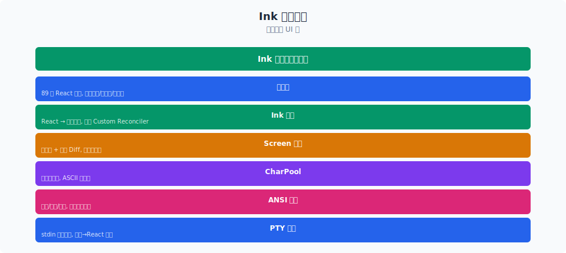
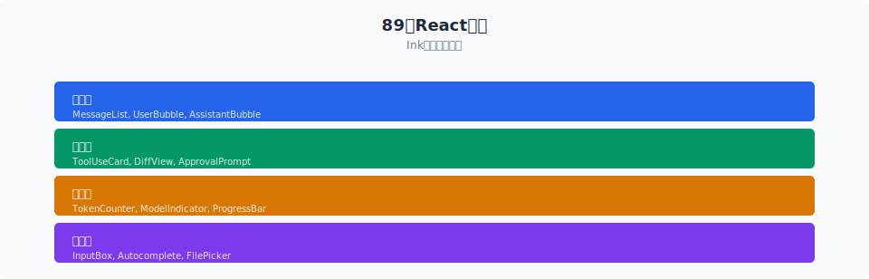

# 组件树与交互：89 个组件如何组织终端界面

> Claude Code 的 UI 层有 89 个 React 组件（`src/components/`），加上 Ink 的渲染原语和 3 个重量级 Screen（REPL.tsx 900KB！），组成了可能是最复杂的终端 UI 之一。本文拆解组件分层、状态管理、动画系统，以及全屏模式下独特的交互模式。

你好，我是江小湖。

[上一篇文章](./01-ink.md) 讲了 Ink 如何把 React 渲染到终端。但组件层面——90+ 个 React 组件如何协作，如何在字符终端里实现流畅的动画和交互——才是真正让人震撼的部分。

## 目录

- [组件分层架构](#组件分层架构)
- [Screen 层：三个重量级页面](#screen-层三个重量级页面)
- [Provider 层：状态注入](#provider-层状态注入)
- [核心交互组件](#核心交互组件)
- [动画系统：字符终端的帧动画](#动画系统字符终端的帧动画)
- [状态同步：AppState 的单向数据流](#状态同步appstate-的单向数据流)
- [全屏模式：超越 REPL](#全屏模式超越-repl)
- [总结](#总结)
- [参考链接](#参考链接)

<p align="center">
  
  <br/>
  <em>六层终端 UI 栈</em>
</p>


<p align="center">
  
  <br/>
  <em>Claude Code 源码解析 16-terminal-ui 配图</em>
</p>
## 组件分层架构

Claude Code 的 UI 组件可以分五层：

```text
┌──────────────────────────────────────────────────────────────┐
│ Screen Layer (screens/)                                       │
│   REPL.tsx (900KB) | Doctor.tsx (73KB) | Resume (60KB)       │
├──────────────────────────────────────────────────────────────┤
│ Provider Layer (AppStateProvider, StatsProvider, etc.)        │
├──────────────────────────────────────────────────────────────┤
│ Feature Components (components/)                              │
│   Messages.tsx | Spinner.tsx | Markdown.tsx | TextInput.tsx   │
│   FullscreenLayout.tsx | TaskList.tsx | StatusLine.tsx        │
├──────────────────────────────────────────────────────────────┤
│ Shared UI (design-system/)                                    │
│   Divider | virtual lists | tool use renderers               │
├──────────────────────────────────────────────────────────────┤
│ Ink Primitives (ink/components/)                              │
│   Box.tsx | Text.tsx | ScrollBox.tsx | Button.tsx | Link.tsx  │
└──────────────────────────────────────────────────────────────┘
```

## Screen 层：三个重量级页面

Claude Code 的导航不像浏览器有 URL 路由——它用 `AppState.currentScreen` 做页面切换：

```typescript
// 概念性——三个 Screen 的职责
type CurrentScreen =
  | 'repl'              // 主交互界面
  | 'doctor'            // /doctor 诊断报告
  | 'resume-conversation'  // /resume 恢复历史会话
```

### REPL.tsx — 900KB 的庞然大物

这是终端界面的心脏——编译后 900KB 的 minified JSX。它包含：

- **消息列表**（Messages.tsx，148KB）— 虚拟滚动、上下文压缩可视化
- **输入区域**（PromptInput）— slash 命令补全、图片粘贴、文本引用解析
- **状态栏**（StatusLine.tsx，49KB）— 模型名、token 用量、成本、effort 指示器
- **Spinner**（88KB）— 工具执行进度、子 Agent 状态树、剩余时间预估
- **全屏布局**（FullscreenLayout.tsx，85KB）— 左侧聊天 / 右侧文件 diff / 顶部标签页

### Doctor.tsx — /doctor 诊断报告

`/doctor` 命令渲染一个完整的诊断界面（73KB），展示：
- 配置文件校验（settings.json、CLAUDE.md、hooks）
- 权限模式分析
- 版本和环境信息
- 已知问题的修复建议

### ResumeConversation.tsx — 历史会话恢复

60KB 的会话浏览器，支持搜索、预览和恢复历史会话。

## Provider 层：状态注入

Claude Code 的 App.tsx 不是直接渲染 UI，而是先挂载 Provider 层：

```typescript
// components/App.tsx — 概念性结构
export function App({ children, initialState, stats }) {
  return (
    <FpsMetricsProvider>
      <AppStateProvider initialState={initialState}>
        <StatsProvider store={stats}>
          {children}
        </StatsProvider>
      </AppStateProvider>
    </FpsMetricsProvider>
  )
}
```

每个 Provider 注入一组 React Context：

| Context | 提供的数据 | 
|---------|-----------|
| AppStateContext | 全局状态：当前 screen、消息列表、权限模式、token 预算 |
| StatsContext | 会话统计：token 使用量、工具调用次数、成本 |
| FpsMetricsContext | 渲染性能：FPS、帧时间 |
| TerminalSizeContext | 终端尺寸（行列数） |
| TerminalFocusContext | 终端是否聚焦（影响 Agent 自主性） |

## 核心交互组件

### Messages.tsx（148KB）— 消息的虚拟滚动

`Messages.tsx` 是 90 个组件中最复杂的之一——148KB 编译输出。它的核心挑战是：**终端没有虚拟滚动的原生支持**。浏览器的 `overflow: scroll` 在终端里不存在。

解决方案：`VirtualMessageList.tsx`（149KB）实现了完整的虚拟滚动：

```typescript
// 概念性——虚拟滚动的核心逻辑
function VirtualMessageList({ messages, scrollOffset }) {
  // 1. 计算消息高度（每个消息可能在 1-N 行之间）
  const messageHeights = messages.map(m => estimateHeight(m))

  // 2. 只渲染可视区域内的消息
  const visibleRange = computeVisibleRange(scrollOffset, terminalHeight, messageHeights)

  // 3. 用 ScrollBox 拦截 ScrollUp/ScrollDown 键
  // 4. 更新 scrollOffset
  return <ScrollBox onScroll={handleScroll}>
    {messages.slice(visibleRange.start, visibleRange.end).map(renderMessage)}
  </ScrollBox>
}
```

实际实现远比这复杂——需要处理消息分组（连续的同类工具调用折叠）、loading 状态、图片渲染、markdown 表格、差异对比视图。

### Markdown.tsx（28KB）— 终端的 Markdown 渲染器

终端 Markdown 和浏览器 Markdown 是两回事——没有 HTML，只有 ANSI：

```typescript
// 概念性——终端 Markdown 的元素映射
const TERMINAL_MARKDOWN_RENDERERS = {
  heading: (text, level) => chalk.bold(text),         // 标题=粗体
  code: (text, lang) => chalk.dim(text),              // 代码=暗色
  link: (text, url) => `<Link url={url}>${text}</Link>`, // 链接=OSC 8
  table: (rows) => <MarkdownTable rows={rows} />,     // 表格=Box 布局
  image: (url) => <ClickableImageRef url={url} />,    // 图片=可点击引用
}
```

`MarkdownTable.tsx`（47KB）把 markdown 表格对齐到字符网格——计算每列的最大宽度，用 `│` 和 `─` 画边框。

### Spinner.tsx（88KB）— 工具执行动画

Spinner 不只是"转圈"——它是多层信息的呈现：

```text
⠋ Generating commit message... (3.2s)
  ├─ Bash(git diff HEAD:) ✓ (0.8s)
  ├─ Bash(git log --oneline:) ✓ (0.3s)
  └─ Generating commit... ⟳ (2.1s)
```

状态树展示：
- **顶层**：当前任务（"Generating commit message"）
- **子节点**：每个工具调用的状态（✓ 完成 / ⟳ 运行中 / ✗ 失败）
- **时间线**：每个步骤的耗时
- **并行执行**：多个子节点可能同时运行

`SpinnerAnimationRow.tsx` 实现了字符终端中的帧动画——利用 Ink 的 `useAnimationFrame` hook 在 60fps 下切换 spinner 字符：

```typescript
// 概念性——spinner 帧
const SPINNER_FRAMES = ['⠋', '⠙', '⠹', '⠸', '⠼', '⠴', '⠦', '⠧', '⠇', '⠏']

function SpinnerAnimation({ fps = 60 }) {
  const frame = useAnimationFrame(fps)
  const char = SPINNER_FRAMES[frame % SPINNER_FRAMES.length]
  return <Text>{char}</Text>
}
```

## 动画系统：字符终端的帧动画

Ink 的动画系统不是你熟悉的 CSS `transition` 或 `@keyframes`——它是**基于帧的渲染循环**。

### useAnimationFrame

```typescript
// ink.tsx 提供的 hook
function useAnimationFrame(fps: number): number {
  // 在 Ink 的渲染循环中同步帧号
  // 组件在每次帧更新时重新渲染
  // React Compiler 的 memo 确保只有变化的组件重渲染
}
```

关键限制：60fps 在浏览器中很轻松，但终端的帧率取决于 **stdout 的写入速度和 ANSI 解析速度**。如果 diff 太大（全屏 200×50 = 10,000 cells），一帧可能超过 16ms——导致帧率下降。

### 性能优化：React Compiler

Claude Code 使用 React Compiler（`react/compiler-runtime`）自动 memoize 组件。在 `TextInput.tsx` 和 `Messages.tsx` 中可以看到 `_c`（compiler cache）模式：

```typescript
// 编译后的组件模式
function TextInput(t0) {
  const $ = _c(7)  // 编译器缓存槽
  // ...
  if ($[0] !== value) {  // 只有 value 变化才重建
    $[0] = value
    $[1] = <Box>...</Box>
  }
  return $[1]
}
```

React Compiler 减少了不必要的重渲染——在 60fps 的字符终端渲染中，每节省一次 diff 都意味着更少的 stdout 写入。

## 状态同步：AppState 的单向数据流

Claude Code 的状态管理不是 Redux 或 Zustand——它是**手动实现的可观察对象**：

```typescript
// state/AppState.ts — 概念性结构
type AppState = {
  messages: Message[]          // 对话历史
  currentScreen: 'repl' | 'doctor' | 'resume-conversation'
  permissionMode: 'default' | 'acceptEdits' | 'plan' | 'bypass'
  isStreaming: boolean         // 模型是否正在生成
  streamingThinking: string    // 推理内容（流式）
  streamingToolUses: ToolUse[] // 进行中的工具调用
  tokenBudget: TokenBudget     // 当前 token 预算
  // ... 更多字段
}

// 状态变更通过 setAppState 触发
function setAppState(updater: (prev: AppState) => AppState) {
  // 1. 执行 updater
  // 2. 触发 React reconcile（Ink 的 scheduleRender）
}
```

数据流方向：

```text
User Input → handlePromptSubmit → setAppState → React reconcile → Ink render → stdout
                         ↑                                              |
                         └── ProcessUserInput ← API response ← query() ←┘
```

## 全屏模式：超越 REPL

Claude Code 默认是 REPL 模式（对话式），但 `FullscreenLayout.tsx`（85KB）支持**分离面板布局**：

```text
┌──────────────┬──────────────────────┐
│ Chat Panel   │ File Diff Panel      │
│              │                      │
│ user: fix    │ -  old line          │
│ this bug     │ +  new line          │
│              │                      │
│ assistant:   │                      │
│ Let me read  │                      │
│ the file...  │                      │
│              │                      │
├──────────────┴──────────────────────┤
│ Prompt: _                           │
└─────────────────────────────────────┘
```

左侧：对话消息（Messages）
右侧：文件 diff 视图（FileEditToolDiff）
底部：输入框（TextInput）
顶部：标签页（TagTabs）

你可以在全屏模式下一边看 AI 改代码的 diff，一边和它对话——完全不需要切换窗口。这在浏览器里很平常，但在终端里需要 Ink 对 `ScrollBox` 和 `Box` 的精确布局控制。

### 全屏 vs REPL 的交互差异

全屏模式下：
- **鼠标跟踪启用**——可以点击 diff 区域的行号跳转到文件
- **点击式按钮**——"Accept" / "Reject" 按钮响应鼠标点击
- **滚动区域**——左右面板独立滚动
- **Alt Screen**——全屏占用整个终端，退出后恢复

REPL 模式（默认）：
- **纯键盘**——无鼠标跟踪，节省终端兼容性问题
- **流式输出**——消息一条条追加，像聊天应用
- **内联工具结果**——工具输出直接显示在消息流中

## 总结

89 个 React 组件 + 3 个 Screen + Ink 的渲染引擎，构成了 Claude Code 的终端 UI 层。几个关键设计：

1. **Screen 切换**——REPL / Doctor / Resume 三个页面通过 `AppState.currentScreen` 导航
2. **Provider 注入**——五个 Context（AppState、Stats、FPS、TerminalSize、TerminalFocus）分层注入状态
3. **虚拟滚动**——`VirtualMessageList` 和 `ScrollBox` 协作，只渲染可视区域的消息
4. **帧动画**——`useAnimationFrame` + React Compiler 的 memo 实现 60fps 的 spinner 和进度指示
5. **单向数据流**——`setAppState(updater) → React reconile → Ink render → ANSI stdout`
6. **双模式**——REPL（纯键盘流式）和 Fullscreen（鼠标交互、面板分割）

这些设计让一个字符终端应用具备了接近 IDE 的交互体验——在 `npm install -g @anthropic-ai/claude-code` 的那一刻，用户下载了一个完整的终端操作系统。

> 学完本章后，请继续阅读 [17 — IDE 集成层](../17-ide-integration/README.md)，看 Bridge 协议如何把终端 Agent 的能力延伸到 VS Code 和 JetBrains IDE。

## 参考链接

- `src/components/App.tsx` — 顶层 Provider 包装（5KB）
- `src/components/Messages.tsx` — 消息列表与虚拟滚动（148KB 编译输出）
- `src/components/Spinner.tsx` — 工具执行动画与状态树（88KB）
- `src/components/Markdown.tsx` — 终端 Markdown 渲染器（28KB）
- `src/components/FullscreenLayout.tsx` — 全屏分割面板布局（85KB）
- `src/components/StatusLine.tsx` — 底部状态栏（49KB）
- `src/screens/REPL.tsx` — 主交互界面（900KB 编译输出）
- `src/ink/components/ScrollBox.tsx` — 终端滚动区域（32KB）
- `src/ink/components/Button.tsx` — 可点击按钮组件（16KB）
