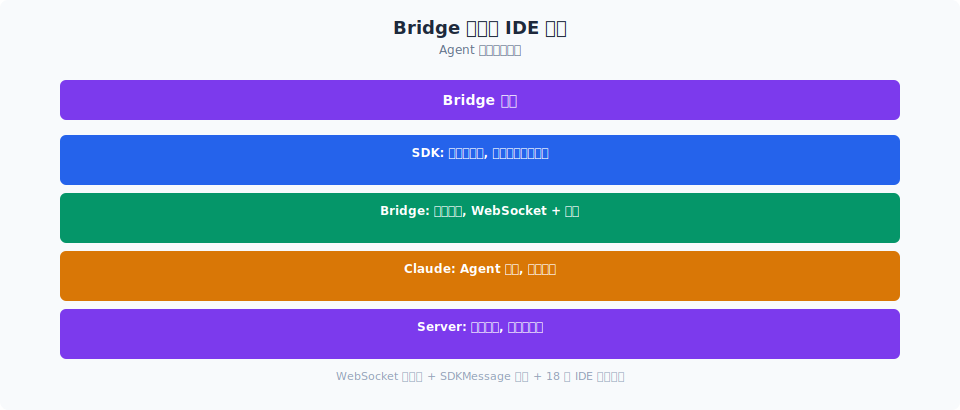
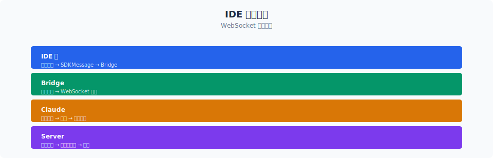

# IDE 桥接实现：从远程控制到编辑器集成

> `src/utils/ide.ts` 有 48KB、支持 18 种 IDE；`bridgeMain.ts` 有 3000 行、管理着 session 的完整生命周期。Bridge 不只是"远程聊天"——它是让 Claude Code 成为一个**跨设备、跨 IDE 的 Agent 操作系统**的基础设施。

你好，我是江小湖。

[上一篇文章](./01-bridge-protocol.md) 讲了 Bridge 协议的 JSON 消息格式和四角色架构。本篇深入两个具体实现：IDE 检测与集成（`ide.ts`）、以及 Bridge 的 session 生命周期管理（`bridgeMain.ts`）。

## 目录

- [IDE 检测：进程树扫描](#ide-检测进程树扫描)
- [IDE 扩展安装与管理](#ide-扩展安装与管理)
- [Bridge Main：Session 生命周期](#bridge-mainsession-生命周期)
- [文件同步：WSL 路径转换](#文件同步wsl-路径转换)
- [多客户端同步](#多客户端同步)
- [总结](#总结)
- [参考链接](#参考链接)

<p align="center">
  
  <br/>
  <em>Agent 如何走出终端集成 IDE</em>
</p>


<p align="center">
  
  <br/>
  <em>Claude Code 源码解析 17-ide-integration 配图</em>
</p>
## IDE 检测：进程树扫描

Claude Code 支持 18 种 IDE（VS Code、Cursor、Windsurf + 15 种 JetBrains IDE）。检测方式不是轮询端口——而是**扫描进程树**。

### 进程签名匹配

```typescript
// utils/ide.ts — 每种 IDE 的定义

const supportedIdeConfigs: Record<IdeType, IdeConfig> = {
  cursor: {
    ideKind: 'vscode',
    displayName: 'Cursor',
    processKeywordsMac: ['Cursor Helper', 'Cursor.app'],
    processKeywordsWindows: ['cursor.exe'],
    processKeywordsLinux: ['cursor'],
  },
  windsurf: {
    ideKind: 'vscode',
    displayName: 'Windsurf',
    processKeywordsMac: ['Windsurf Helper', 'Windsurf.app'],
    processKeywordsWindows: ['windsurf.exe'],
    processKeywordsLinux: ['windsurf'],
  },
  // ... 16 种 JetBrains IDE（intellij, pycharm, webstorm, goland, ...）
}
```

每种 IDE 有三组平台关键词：

| 平台 | VS Code 系列 | JetBrains 系列 |
|------|------------|---------------|
| macOS | `Code Helper` / `Cursor.app` | `IntelliJ IDEA` |
| Windows | `code.exe` / `cursor.exe` | `idea64.exe` |
| Linux | `code` / `cursor` | `idea` / `intellij` |

### 检测流程

```typescript
// 概念性——IDE 检测的核心逻辑

async function detectRunningIDEs(): Promise<IdeType[]> {
  // 1. 获取当前进程的祖先 PID 链
  const ancestorPids = await getAncestorPidsAsync(process.pid)

  // 2. 遍历所有运行中的进程
  const runningProcesses = await psList()

  // 3. 对每种 IDE 类型：
  for (const [ideType, config] of Object.entries(supportedIdeConfigs)) {
    const keywords = config[`processKeywords${platform}`]
    // 4. 检查是否有进程名匹配关键词
    const match = runningProcesses.find(p => keywords.some(k => p.name.includes(k)))
    if (match) detected.push(ideType)
  }

  return detected
}
```

为什么用进程树而不是端口扫描？
- VS Code 的 MCP 端口可能在不同版本间变化
- JetBrains IDE 使用动态端口
- 进程树更可靠——只要 IDE 在运行，进程就在

## IDE 扩展安装与管理

检测到 IDE 后，Claude Code 需要安装自己的扩展：

### VS Code / Cursor / Windsurf

```typescript
// utils/ide.ts — VS Code 扩展安装

async function installVSCodeExtension(ideType: IdeType): Promise<void> {
  // 1. 找到 IDE 的可执行文件（code, cursor, windsurf）
  const binPath = findVSCodeBinary(ideType)

  // 2. 使用 --install-extension 安装
  await execa(binPath, [
    '--install-extension',
    'anthropic.claude-code'  // VS Code marketplace 上的扩展 ID
  ])
}
```

### JetBrains IDE

JetBrains 的扩展安装更复杂——因为 IDE 的插件目录和可执行文件因版本而异：

```typescript
// utils/ide.ts — JetBrains 扩展检测

async function isJetBrainsPluginInstalled(ideType: IdeType): Promise<boolean> {
  // 1. 找到 IDE 的插件目录
  //    macOS: ~/Library/Application Support/<IDE>/plugins/
  //    Windows: %APPDATA%/<IDE>/plugins/
  //    Linux: ~/.local/share/<IDE>/plugins/
  const pluginsDir = getJetBrainsPluginsDir(ideType)

  // 2. 检查 anthropic-plugin 目录是否存在
  const pluginPath = join(pluginsDir, 'anthropic-plugin')
  return getFsImplementation().existsSync(pluginPath)
}
```

### IDE 自动连接

当用户在 VS Code 中输入 `/ide` 时，Claude Code 自动：
1. 检测正在运行的 IDE
2. 安装扩展（如果缺失）
3. 建立连接
4. 开始文件编辑同步

整个过程通过 `IdeOnboardingDialog.tsx`（16KB）的交互式向导完成。

## Bridge Main：Session 生命周期

`bridgeMain.ts` 是 Bridge 的后台主循环——它独立于 Ink UI，在 Agent 进程启动时就开始运行。

### Work Polling 循环

```typescript
// bridge/bridgeMain.ts — 概念性结构

async function runBridgeMain(config: BridgeConfig) {
  const client = createBridgeApiClient(config)
  const sessionSpawner = createSessionSpawner(config)

  // 持续轮询，直到进程退出
  while (true) {
    // 1. Poll for work
    const work = await pollForWork(client, lastPollTime)

    if (work) {
      // 2. Validate secret
      const secret = decodeWorkSecret(work.secret)

      // 3. Spawn a session
      const session = await sessionSpawner.spawn({
        sessionId: work.data.id,
        secret,
        worktree: createAgentWorktree(),
      })

      // 4. Wait for session to complete
      const status = await session.wait()
      logEvent('bridge_session_done', { status })

      // 5. Cleanup
      removeAgentWorktree(session.worktree)
    }

    // 6. Wait before next poll
    await sleep(config.pollInterval)
  }
}
```

### Backoff 重连

网络中断时，Bridge 使用指数退避重连：

```typescript
type BackoffConfig = {
  connInitialMs: number    // 初始重连延迟（如 1s）
  connMaxMs: number        // 最大重连延迟（如 60s）
  connMultiplier: number   // 退避乘数（如 2）
}
// 重连序列: 1s → 2s → 4s → 8s → 16s → 32s → 60s → 60s ...
```

### Capacity Wake

当 Agent session 被 `sleep` 中断时，Bridge 需要能被远程唤醒：

```typescript
// bridge/capacityWake.ts
// 创建 wake 信号 — 当远程客户端发送消息时
// 如果 session 处于 sleep 状态，自动唤醒
```

这保证了用户在手机上发消息时，即使 Agent 在 3 小时前就 sleep 了，也能被唤醒并开始处理。

## 文件同步：WSL 路径转换

当 Claude Code 在 Windows 上运行但项目在 WSL 中，或者使用 VS Code Remote SSH 时，文件路径需要在不同的文件系统间转换：

```typescript
// utils/idePathConversion.ts

class WindowsToWSLConverter {
  // C:\Users\Hpl\Projects\my-app → \\wsl$\Ubuntu\home\hpl\my-app
  toWSL(windowsPath: string): string

  // \\wsl$\Ubuntu\home\hpl\my-app → /home/hpl/my-app
  fromWSL(wslPath: string): string
}
```

这是 IDE 集成的"隐形"基础设施——用户在 VS Code 中点击一个文件，Bridge 需要确保 Agent 在正确的文件系统中操作。

## 多客户端同步

一个 Bridge session 可以有多个客户端同时连接：

```text
                ┌──────────────┐
                │ Bridge API   │
                │ Server       │
                └──┬───┬───┬──┘
                   │   │   │
        ┌──────────┘   │   └──────────┐
        ▼              ▼              ▼
   ┌─────────┐   ┌─────────┐   ┌─────────┐
   │ Mobile  │   │ Web     │   │ VS Code │
   │ App     │   │ Dashboard│   │ Extension│
   └─────────┘   └─────────┘   └─────────┘
```

所有客户端看到相同的：
- 消息历史（通过 session activity 流）
- Token 用量（通过 status 消息）
- 工具执行状态（通过 tool_use / tool_result 消息）

但只有一个 Agent 实例在执行——所有客户端的输入排队到同一个 `handlePromptSubmit` 路径。

### Concurrent Sessions

`utils/concurrentSessions.ts` 管理着多个可能的并发 session：

```typescript
// utils/concurrentSessions.ts
function updateSessionBridgeId(sessionId: string, bridgeId: string): void {
  // 将新创建的 Bridge session 注册到全局 session map
  // 防止重复创建同一个 remote session
}
```

## 总结

`ide.ts`（48KB）和 `bridgeMain.ts`（3000 行）分别代表了 IDE 集成的两个层面：

1. **IDE 检测**——通过进程树扫描支持 18 种 IDE，而不是端口扫描
2. **扩展管理**——VS Code 用 `--install-extension`，JetBrains 用文件系统检测
3. **Work Polling**——Agent 启动后持续轮询，等待工作分配
4. **Exponential Backoff**——网络中断时自动重连，从 1s 到 60s
5. **WSL 路径转换**——让跨文件系统操作透明化
6. **多客户端同步**——所有客户端看到同一个 Agent 的实时状态

这个设计让 Claude Code 不是一个"终端插件"，而是一个可以被手机、Web、IDE 同时接入的 **Agent 操作系统**。Bridge 就是它的 I/O 总线。

---

> **全系列完。** Claude Code 源码解析系列至此结束——从 [01 — 整体架构](../01-architecture-overview/README.md) 的层次化设计，到本章的 Bridge 协议，共 17 章、52 篇文章。感谢阅读。

## 参考链接

- `src/utils/ide.ts` — IDE 检测与集成（48KB，支持 18 种 IDE）
- `src/bridge/bridgeMain.ts` — Bridge 主循环与 session 生命周期（3000 行，118KB）
- `src/bridge/replBridge.ts` — Bridge 连接管理（2400 行，102KB）
- `src/bridge/capacityWake.ts` — 远程唤醒机制
- `src/utils/idePathConversion.ts` — WSL/Windows 路径转换
- `src/utils/concurrentSessions.ts` — 多 session 并发管理
